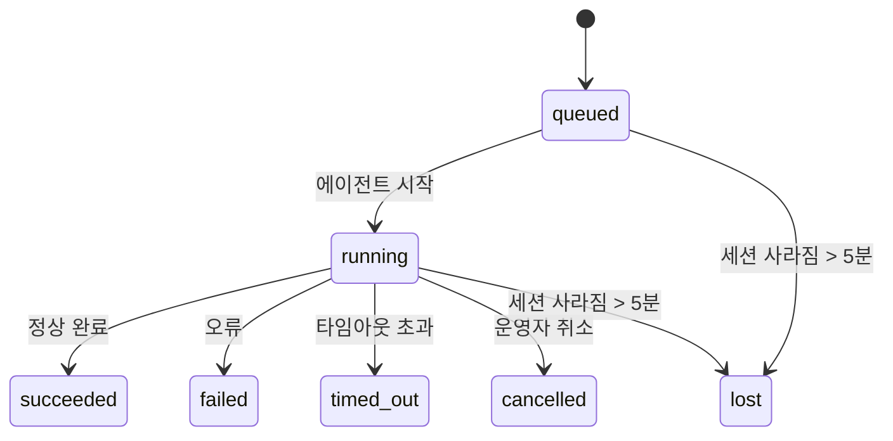

# 백그라운드 태스크

> **예약을 찾고 계십니까?** 적합한 메커니즘 선택은 [자동화 및 태스크](/automation)를 참조하십시오. 이 페이지는 작업 **예약**이 아닌 백그라운드 작업 **추적**을 다룹니다.

백그라운드 태스크는 **메인 대화 세션 외부에서** 실행되는 작업을 추적합니다:
ACP 실행, 서브에이전트 생성, 독립 크론 작업 실행, CLI 시작 작업.

태스크는 세션, 크론 작업, 하트비트를 **대체하지 않습니다** — 분리된 작업이 언제, 어떻게 발생했는지, 성공했는지를 기록하는 **활동 원장**입니다.

<Note>
모든 에이전트 실행이 태스크를 생성하는 것은 아닙니다. 하트비트 턴과 일반 대화식 채팅은 생성하지 않습니다. 모든 크론 실행, ACP 생성, 서브에이전트 생성, CLI 에이전트 명령은 생성합니다.
</Note>

## 요약

- 태스크는 스케줄러가 아닌 **레코드**입니다 — 크론과 하트비트는 작업이 _언제_ 실행될지를 결정하고, 태스크는 _무슨 일이 일어났는지_를 추적합니다.
- ACP, 서브에이전트, 모든 크론 작업, CLI 작업은 태스크를 생성합니다. 하트비트 턴은 생성하지 않습니다.
- 각 태스크는 `queued → running → terminal` (succeeded, failed, timed_out, cancelled, 또는 lost)을 거쳐 이동합니다.
- 크론 태스크는 크론 런타임이 작업을 아직 실행 중으로 추적하는 동안 유효하게 유지됩니다; 채팅 기반 CLI 태스크는 소유하는 실행 컨텍스트가 활성 상태인 동안만 유효하게 유지됩니다.
- 완료는 푸시 기반입니다: 분리된 작업은 완료 시 직접 알리거나 요청자 세션/하트비트를 깨울 수 있으므로, 상태 폴링 루프는 일반적으로 적합하지 않습니다.
- 독립 크론 실행과 서브에이전트 완료는 최종 정리 작업 전에 자식 세션의 추적된 브라우저 탭/프로세스를 최선 노력으로 정리합니다.
- 독립 크론 전달은 하위 서브에이전트 작업이 아직 진행 중인 동안 오래된 중간 부모 응답을 억제하며, 해당 출력이 전달 전에 도착하면 최종 하위 출력을 선호합니다.
- 완료 알림은 채널에 직접 전달되거나 다음 하트비트를 위해 큐에 넣어집니다.
- `openclaw tasks list`는 모든 태스크를 표시합니다; `openclaw tasks audit`는 문제를 드러냅니다.
- 완료된 레코드는 7일간 보관된 후 자동으로 정리됩니다.

## 빠른 시작

```bash
# 모든 태스크 목록 (최신 순)
openclaw tasks list

# 런타임 또는 상태로 필터링
openclaw tasks list --runtime acp
openclaw tasks list --status running

# 특정 태스크의 상세 정보 표시 (ID, 실행 ID, 또는 세션 키로)
openclaw tasks show <lookup>

# 실행 중인 태스크 취소 (자식 세션 종료)
openclaw tasks cancel <lookup>

# 태스크의 알림 정책 변경
openclaw tasks notify <lookup> state_changes

# 상태 감사 실행
openclaw tasks audit

# 유지 관리 미리보기 또는 적용
openclaw tasks maintenance
openclaw tasks maintenance --apply

# TaskFlow 상태 검사
openclaw tasks flow list
openclaw tasks flow show <lookup>
openclaw tasks flow cancel <lookup>
```

## 태스크를 생성하는 항목

| 소스                   | 런타임 유형   | 태스크 레코드 생성 시점                                | 기본 알림 정책 |
| ---------------------- | ------------- | ------------------------------------------------------ | -------------- |
| ACP 백그라운드 실행    | `acp`         | 자식 ACP 세션 생성                                     | `done_only`    |
| 서브에이전트 조율      | `subagent`    | `sessions_spawn`을 통한 서브에이전트 생성              | `done_only`    |
| 크론 작업 (모든 유형)  | `cron`        | 모든 크론 실행 (메인 세션 및 독립)                     | `silent`       |
| CLI 작업               | `cli`         | 게이트웨이를 통해 실행되는 `openclaw agent` 명령       | `silent`       |
| 에이전트 미디어 작업   | `cli`         | 세션 기반 `video_generate` 실행                        | `silent`       |

메인 세션 크론 태스크는 기본적으로 `silent` 알림 정책을 사용합니다 — 추적을 위한 레코드를 생성하지만 알림을 생성하지 않습니다. 독립 크론 태스크도 기본값은 `silent`이지만 자체 세션에서 실행되므로 더 잘 보입니다.

세션 기반 `video_generate` 실행도 `silent` 알림 정책을 사용합니다. 태스크 레코드는 생성되지만, 완료는 원래 에이전트 세션에 내부 깨우기로 전달되어 에이전트가 후속 메시지를 작성하고 완성된 비디오를 직접 첨부할 수 있습니다. `tools.media.asyncCompletion.directSend`를 선택하면, 비동기 `music_generate` 및 `video_generate` 완료는 요청자 세션 깨우기 경로로 대체하기 전에 직접 채널 전달을 먼저 시도합니다.

세션 기반 `video_generate` 태스크가 여전히 활성 상태인 동안, 도구는 가드레일 역할도 합니다: 동일한 세션에서 반복적인 `video_generate` 호출은 두 번째 동시 생성을 시작하는 대신 활성 태스크 상태를 반환합니다. 에이전트 측에서 명시적인 진행/상태 조회를 원할 때는 `action: "status"`를 사용하십시오.

**태스크를 생성하지 않는 항목:**

- 하트비트 턴 — 메인 세션; [하트비트](/gateway/heartbeat) 참조
- 일반 대화식 채팅 턴
- 직접 `/command` 응답

## 태스크 수명 주기



| 상태        | 의미                                                                        |
| ----------- | --------------------------------------------------------------------------- |
| `queued`    | 생성됨, 에이전트 시작 대기 중                                               |
| `running`   | 에이전트 턴이 적극적으로 실행 중                                            |
| `succeeded` | 성공적으로 완료됨                                                           |
| `failed`    | 오류와 함께 완료됨                                                          |
| `timed_out` | 구성된 타임아웃 초과                                                        |
| `cancelled` | `openclaw tasks cancel`로 운영자가 중지                                     |
| `lost`      | 런타임이 5분 유예 기간 후 권위 있는 백업 상태를 잃음                        |

전환은 자동으로 발생합니다 — 연결된 에이전트 실행이 종료되면 태스크 상태가 일치하도록 업데이트됩니다.

`lost`는 런타임 인식입니다:

- ACP 태스크: 백업 ACP 자식 세션 메타데이터가 사라짐.
- 서브에이전트 태스크: 대상 에이전트 저장소에서 백업 자식 세션이 사라짐.
- 크론 태스크: 크론 런타임이 더 이상 작업을 활성으로 추적하지 않음.
- CLI 태스크: 독립 자식 세션 태스크는 자식 세션을 사용; 채팅 기반 CLI 태스크는 라이브 실행 컨텍스트를 대신 사용하므로, 남아 있는 채널/그룹/직접 세션 행이 이를 유지하지 않습니다.

## 전달 및 알림

태스크가 터미널 상태에 도달하면 OpenClaw가 알립니다. 두 가지 전달 경로가 있습니다:

**직접 전달** — 태스크에 채널 대상(`requesterOrigin`)이 있으면, 완료 메시지가 해당 채널(Telegram, Discord, Slack 등)로 직접 전달됩니다. 서브에이전트 완료의 경우, OpenClaw는 가능한 경우 바인딩된 스레드/주제 라우팅을 보존하며 직접 전달을 포기하기 전에 요청자 세션의 저장된 라우트(`lastChannel` / `lastTo` / `lastAccountId`)에서 누락된 `to` / 계정을 채울 수 있습니다.

**세션 큐 전달** — 직접 전달이 실패하거나 출처가 설정되지 않은 경우, 업데이트가 요청자 세션의 시스템 이벤트로 큐에 넣어지고 다음 하트비트에 표시됩니다.

<Tip>
태스크 완료는 즉각적인 하트비트 깨우기를 트리거하므로 결과를 빠르게 확인할 수 있습니다 — 다음 예약된 하트비트 틱을 기다릴 필요가 없습니다.
</Tip>

즉, 일반적인 워크플로우는 푸시 기반입니다: 분리된 작업을 한 번 시작하고, 완료 시 런타임이 깨우거나 알리도록 둡니다. 디버깅, 개입, 또는 명시적 감사가 필요할 때만 태스크 상태를 폴링하십시오.

### 알림 정책

각 태스크에 대해 얼마나 많은 알림을 받을지 제어합니다:

| 정책                  | 전달 내용                                                               |
| --------------------- | ----------------------------------------------------------------------- |
| `done_only` (기본값)  | 터미널 상태만 (succeeded, failed 등) — **이것이 기본값입니다**         |
| `state_changes`       | 모든 상태 전환 및 진행 업데이트                                         |
| `silent`              | 아무것도 없음                                                           |

태스크가 실행 중인 동안 정책 변경:

```bash
openclaw tasks notify <lookup> state_changes
```

## CLI 참조

### `tasks list`

```bash
openclaw tasks list [--runtime <acp|subagent|cron|cli>] [--status <status>] [--json]
```

출력 열: 태스크 ID, 종류, 상태, 전달, 실행 ID, 자식 세션, 요약.

### `tasks show`

```bash
openclaw tasks show <lookup>
```

조회 토큰은 태스크 ID, 실행 ID, 또는 세션 키를 허용합니다. 타이밍, 전달 상태, 오류, 터미널 요약을 포함한 전체 레코드를 표시합니다.

### `tasks cancel`

```bash
openclaw tasks cancel <lookup>
```

ACP 및 서브에이전트 태스크의 경우, 자식 세션을 종료합니다. 상태가 `cancelled`로 전환되고 전달 알림이 전송됩니다.

### `tasks notify`

```bash
openclaw tasks notify <lookup> <done_only|state_changes|silent>
```

### `tasks audit`

```bash
openclaw tasks audit [--json]
```

운영 문제를 드러냅니다. 문제가 감지되면 결과가 `openclaw status`에도 표시됩니다.

| 결과                      | 심각도 | 트리거                                                  |
| ------------------------- | ------ | ------------------------------------------------------- |
| `stale_queued`            | 경고   | 10분 이상 큐에 있음                                     |
| `stale_running`           | 오류   | 30분 이상 실행 중                                       |
| `lost`                    | 오류   | 런타임 기반 태스크 소유권이 사라짐                      |
| `delivery_failed`         | 경고   | 전달 실패이고 알림 정책이 `silent`가 아님               |
| `missing_cleanup`         | 경고   | 정리 타임스탬프가 없는 터미널 태스크                    |
| `inconsistent_timestamps` | 경고   | 타임라인 위반 (예: 시작 전에 종료)                      |

### `tasks maintenance`

```bash
openclaw tasks maintenance [--json]
openclaw tasks maintenance --apply [--json]
```

태스크 및 태스크 플로우 상태에 대한 조정, 정리 스탬핑, 정리를 미리보거나 적용하는 데 사용합니다.

조정은 런타임 인식입니다:

- ACP/서브에이전트 태스크는 백업 자식 세션을 확인합니다.
- 크론 태스크는 크론 런타임이 여전히 작업을 소유하는지 확인합니다.
- 채팅 기반 CLI 태스크는 채팅 세션 행이 아닌 소유하는 라이브 실행 컨텍스트를 확인합니다.

완료 정리도 런타임 인식입니다:

- 서브에이전트 완료는 announce 정리가 계속되기 전에 자식 세션에 대해 추적된 브라우저 탭/프로세스를 최선 노력으로 종료합니다.
- 독립 크론 완료는 실행이 완전히 종료되기 전에 크론 세션에 대해 추적된 브라우저 탭/프로세스를 최선 노력으로 종료합니다.
- 독립 크론 전달은 필요한 경우 하위 서브에이전트 후속 조치를 기다리며, 발표하는 대신 오래된 부모 확인 텍스트를 억제합니다.
- 서브에이전트 완료 전달은 최신 표시된 어시스턴트 텍스트를 선호합니다; 비어 있으면 삭제된 최신 도구/toolResult 텍스트로 대체하고, 타임아웃 전용 도구 호출 실행은 짧은 부분 진행 요약으로 축소될 수 있습니다.
- 정리 실패는 실제 태스크 결과를 가리지 않습니다.

### `tasks flow list|show|cancel`

```bash
openclaw tasks flow list [--status <status>] [--json]
openclaw tasks flow show <lookup> [--json]
openclaw tasks flow cancel <lookup>
```

개별 백그라운드 태스크 레코드보다 조율하는 태스크 플로우가 관심사일 때 사용하십시오.

## 채팅 태스크 보드 (`/tasks`)

임의의 채팅 세션에서 `/tasks`를 사용하면 해당 세션에 연결된 백그라운드 태스크를 볼 수 있습니다. 보드에는 런타임, 상태, 타이밍, 진행 또는 오류 상세 정보와 함께 활성 및 최근 완료된 태스크가 표시됩니다.

현재 세션에 표시되는 연결된 태스크가 없으면, `/tasks`는 다른 세션 세부 사항을 유출하지 않으면서 개요를 제공하기 위해 에이전트 로컬 태스크 수로 대체됩니다.

전체 운영자 원장은 CLI를 사용하십시오: `openclaw tasks list`.

## 상태 통합 (태스크 압력)

`openclaw status`에는 한눈에 볼 수 있는 태스크 요약이 포함됩니다:

```
Tasks: 3 queued · 2 running · 1 issues
```

요약 보고:

- **활성** — `queued` + `running` 수
- **실패** — `failed` + `timed_out` + `lost` 수
- **byRuntime** — `acp`, `subagent`, `cron`, `cli`별 분류

`/status`와 `session_status` 도구 모두 정리 인식 태스크 스냅샷을 사용합니다: 활성 태스크가 우선되고, 오래된 완료 행은 숨겨지며, 최근 실패는 활성 작업이 없을 때만 표시됩니다. 이를 통해 상태 카드가 현재 중요한 것에 집중됩니다.

## 저장 및 유지 관리

### 태스크 저장 위치

태스크 레코드는 다음 SQLite에 유지됩니다:

```
$OPENCLAW_STATE_DIR/tasks/runs.sqlite
```

레지스트리는 게이트웨이 시작 시 메모리에 로드되며, 재시작 후 내구성을 위해 SQLite에 동기적으로 쓰기가 이루어집니다.

### 자동 유지 관리

스위퍼는 **60초**마다 실행되며 세 가지를 처리합니다:

1. **조정** — 활성 태스크에 아직 권위 있는 런타임 백업이 있는지 확인합니다. ACP/서브에이전트 태스크는 자식 세션 상태를 사용하고, 크론 태스크는 활성 작업 소유권을 사용하며, 채팅 기반 CLI 태스크는 소유하는 실행 컨텍스트를 사용합니다. 해당 백업 상태가 5분 이상 사라지면 태스크가 `lost`로 표시됩니다.
2. **정리 스탬핑** — 터미널 태스크에 `cleanupAfter` 타임스탬프를 설정합니다 (endedAt + 7일).
3. **정리** — `cleanupAfter` 날짜가 지난 레코드를 삭제합니다.

**보존**: 터미널 태스크 레코드는 **7일**간 보관된 후 자동으로 정리됩니다. 별도의 설정이 필요하지 않습니다.

## 태스크와 다른 시스템의 관계

### 태스크와 태스크 플로우

[태스크 플로우](/automation/taskflow)는 백그라운드 태스크 위에 있는 플로우 조율 레이어입니다. 단일 플로우는 관리형 또는 미러링 동기화 모드를 사용하여 수명 주기 동안 여러 태스크를 조율할 수 있습니다. 개별 태스크 레코드를 검사하려면 `openclaw tasks`를 사용하고, 조율 플로우를 검사하려면 `openclaw tasks flow`를 사용하십시오.

자세한 내용은 [태스크 플로우](/automation/taskflow)를 참조하십시오.

### 태스크와 크론

크론 작업 **정의**는 `~/.openclaw/cron/jobs.json`에 있습니다. **모든** 크론 실행은 태스크 레코드를 생성합니다 — 메인 세션 및 독립 모두. 메인 세션 크론 태스크는 기본적으로 `silent` 알림 정책을 사용하므로 알림을 생성하지 않고 추적합니다.

[크론 작업](/automation/cron-jobs)을 참조하십시오.

### 태스크와 하트비트

하트비트 실행은 메인 세션 턴입니다 — 태스크 레코드를 생성하지 않습니다. 태스크가 완료되면 하트비트 깨우기를 트리거하여 결과를 빠르게 확인할 수 있습니다.

[하트비트](/gateway/heartbeat)를 참조하십시오.

### 태스크와 세션

태스크는 `childSessionKey` (작업이 실행되는 위치)와 `requesterSessionKey` (시작한 주체)를 참조할 수 있습니다. 세션은 대화 컨텍스트이고, 태스크는 그 위에 있는 활동 추적입니다.

### 태스크와 에이전트 실행

태스크의 `runId`는 작업을 수행하는 에이전트 실행에 연결됩니다. 에이전트 수명 주기 이벤트(시작, 종료, 오류)는 자동으로 태스크 상태를 업데이트합니다 — 수명 주기를 수동으로 관리할 필요가 없습니다.

## 관련 항목

- [자동화 및 태스크](/automation) — 한눈에 보는 모든 자동화 메커니즘
- [태스크 플로우](/automation/taskflow) — 태스크 위의 플로우 조율
- [예약된 태스크](/automation/cron-jobs) — 백그라운드 작업 예약
- [하트비트](/gateway/heartbeat) — 주기적인 메인 세션 턴
- [CLI: 태스크](/cli/index#tasks) — CLI 명령 참조
