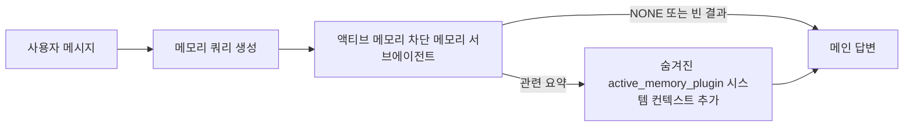

# Active Memory

Active memory는 대화형 세션에서 **메인 답변 전에 실행되는** 선택적 플러그인 소유 차단 메모리 서브에이전트입니다.

대부분의 메모리 시스템은 기능적으로는 가능하지만 **반응형**입니다. 메인 에이전트가 언제 메모리를 검색할지 결정하거나, 사용자가 "remember this" 또는 "search memory"라고 말해야 합니다. 그때쯤이면 메모리가 답변을 자연스럽게 만들었을 시점은 이미 지나 있습니다.

Active memory는 메인 답변이 생성되기 전에 **관련 메모리를 표면화할 수 있는 한 번의 기회**를 시스템에 제공합니다.

## 에이전트에 붙여넣기

자체 포함된 안전 기본 설정으로 Active Memory를 활성화하려면 다음을 에이전트에 붙여넣으십시오:

```json5
{
  plugins: {
    entries: {
      "active-memory": {
        enabled: true,
        config: {
          enabled: true,
          agents: ["main"],
          allowedChatTypes: ["direct"],
          modelFallback: "google/gemini-3-flash",
          queryMode: "recent",
          promptStyle: "balanced",
          timeoutMs: 15000,
          maxSummaryChars: 220,
          persistTranscripts: false,
          logging: true,
        },
      },
    },
  },
}
```

이 설정은 `main` 에이전트에 플러그인을 켜고, 기본적으로 다이렉트 메시지 스타일 세션으로 제한하며, 먼저 현재 세션 모델을 상속받게 하고, 명시적 또는 상속된 모델을 사용할 수 없는 경우에만 구성된 폴백 모델을 사용합니다.

그런 다음 게이트웨이를 재시작합니다:

```bash
openclaw gateway
```

라이브 대화에서 검사하려면:

```text
/verbose on
/trace on
```

## 액티브 메모리 켜기

가장 안전한 설정은 다음과 같습니다:

1. 플러그인 활성화
2. 하나의 대화형 에이전트를 대상으로 지정
3. 조정 중에만 로깅 켜기

`openclaw.json`에서 다음으로 시작합니다:

```json5
{
  plugins: {
    entries: {
      "active-memory": {
        enabled: true,
        config: {
          agents: ["main"],
          allowedChatTypes: ["direct"],
          modelFallback: "google/gemini-3-flash",
          queryMode: "recent",
          promptStyle: "balanced",
          timeoutMs: 15000,
          maxSummaryChars: 220,
          persistTranscripts: false,
          logging: true,
        },
      },
    },
  },
}
```

그런 다음 게이트웨이를 재시작합니다:

```bash
openclaw gateway
```

의미:

- `plugins.entries.active-memory.enabled: true` — 플러그인을 켭니다
- `config.agents: ["main"]` — `main` 에이전트만 액티브 메모리를 사용하도록 지정합니다
- `config.allowedChatTypes: ["direct"]` — 기본적으로 다이렉트 메시지 스타일 세션에서만 액티브 메모리를 작동시킵니다
- `config.model`이 설정되지 않은 경우, 액티브 메모리는 먼저 현재 세션 모델을 상속받습니다
- `config.modelFallback` — 리콜을 위한 선택적 자체 폴백 프로바이더/모델을 제공합니다
- `config.promptStyle: "balanced"` — `recent` 모드에 대한 기본 범용 프롬프트 스타일을 사용합니다
- 액티브 메모리는 여전히 **적격 대화형 지속 채팅 세션**에서만 실행됩니다

## 확인하는 방법

액티브 메모리는 모델을 위해 숨겨진 시스템 컨텍스트를 주입합니다. 원시 `<active_memory_plugin>...</active_memory_plugin>` 태그를 클라이언트에 노출하지 않습니다.

## 세션 토글

설정을 편집하지 않고 현재 채팅 세션에서 액티브 메모리를 일시 중지하거나 재개하려면 플러그인 명령을 사용합니다:

```text
/active-memory status
/active-memory off
/active-memory on
```

이것은 세션 범위입니다. `plugins.entries.active-memory.enabled`, 에이전트 타겟팅, 또는 기타 전역 설정을 변경하지 않습니다.

명령이 설정을 작성하고 모든 세션에 대해 액티브 메모리를 일시 중지하거나 재개하려면 명시적 전역 형식을 사용합니다:

```text
/active-memory status --global
/active-memory off --global
/active-memory on --global
```

전역 형식은 `plugins.entries.active-memory.config.enabled`를 작성합니다. 나중에 다시 켤 수 있도록 `plugins.entries.active-memory.enabled`는 켜진 상태로 둡니다.

라이브 세션에서 액티브 메모리가 무엇을 하고 있는지 보려면 원하는 출력과 일치하는 세션 토글을 켭니다:

```text
/verbose on
/trace on
```

이것을 켜면 OpenClaw는 다음을 표시할 수 있습니다:

- `/verbose on`일 때 `Active Memory: ok 842ms recent 34 chars` 같은 액티브 메모리 상태 줄
- `/trace on`일 때 `Active Memory Debug: Lemon pepper wings with blue cheese.` 같은 읽을 수 있는 디버그 요약

이 줄들은 숨겨진 시스템 컨텍스트를 제공하는 동일한 액티브 메모리 패스에서 파생되지만, 원시 프롬프트 마크업 대신 사람이 읽을 수 있도록 포맷됩니다. 일반 어시스턴트 답변 후에 팔로업 진단 메시지로 전송되므로 Telegram 같은 채널 클라이언트에 별도의 사전 답변 진단 버블이 표시되지 않습니다.

기본적으로 차단 메모리 서브에이전트 트랜스크립트는 임시적이며 실행 완료 후 삭제됩니다.

예시 흐름:

```text
/verbose on
/trace on
what wings should i order?
```

예상되는 표시되는 답변 형태:

```text
...normal assistant reply...

🧩 Active Memory: ok 842ms recent 34 chars
🔎 Active Memory Debug: Lemon pepper wings with blue cheese.
```

## 실행 시기

액티브 메모리는 두 개의 게이트를 사용합니다:

1. **설정 옵트인**
   플러그인이 활성화되어야 하고, 현재 에이전트 ID가 `plugins.entries.active-memory.config.agents`에 나타나야 합니다.
2. **엄격한 런타임 자격**
   활성화되고 타겟팅되어도, 액티브 메모리는 **적격 대화형 지속 채팅 세션**에서만 실행됩니다.

실제 규칙:

```text
플러그인 활성화
+
에이전트 ID 타겟팅
+
허용된 채팅 타입
+
적격 대화형 지속 채팅 세션
=
액티브 메모리 실행
```

이 중 하나라도 실패하면 액티브 메모리는 실행되지 않습니다.

## 세션 타입

`config.allowedChatTypes`는 어떤 종류의 대화에서 액티브 메모리를 실행할 수 있는지 제어합니다.

기본값:

```json5
allowedChatTypes: ["direct"]
```

즉, 액티브 메모리는 기본적으로 다이렉트 메시지 스타일 세션에서 실행되며, 그룹이나 채널 세션에서는 명시적으로 옵트인하지 않는 한 실행되지 않습니다.

예시:

```json5
allowedChatTypes: ["direct"]
```

```json5
allowedChatTypes: ["direct", "group"]
```

```json5
allowedChatTypes: ["direct", "group", "channel"]
```

## 실행 위치

액티브 메모리는 **대화형 강화 기능**이지 플랫폼 전체 추론 기능이 아닙니다.

| 표면                                                                    | 액티브 메모리 실행?                                     |
| ---------------------------------------------------------------------- | ------------------------------------------------------- |
| Control UI / 웹 채팅 지속 세션                                          | 예, 플러그인이 활성화되고 에이전트가 타겟팅된 경우      |
| 동일한 지속 채팅 경로의 다른 대화형 채널 세션                             | 예, 플러그인이 활성화되고 에이전트가 타겟팅된 경우      |
| 헤드리스 원샷 실행                                                      | 아니오                                                  |
| 하트비트/백그라운드 실행                                                 | 아니오                                                  |
| 일반 내부 `agent-command` 경로                                           | 아니오                                                  |
| 서브에이전트/내부 헬퍼 실행                                              | 아니오                                                  |

## 왜 사용하는가

다음의 경우 액티브 메모리를 사용합니다:

- 세션이 지속적이고 사용자를 대면하는 경우
- 에이전트에 검색할 의미 있는 장기 메모리가 있는 경우
- 연속성과 개인화가 원시 프롬프트 결정론보다 중요한 경우

특히 잘 작동하는 경우:

- 안정적인 선호도
- 반복적인 습관
- 자연스럽게 표면화되어야 하는 장기 사용자 컨텍스트

적합하지 않은 경우:

- 자동화
- 내부 워커
- 원샷 API 작업
- 숨겨진 개인화가 놀라울 수 있는 곳

## 작동 방식

런타임 형태:



차단 메모리 서브에이전트는 다음만 사용할 수 있습니다:

- `memory_search`
- `memory_get`

연결이 약하면 `NONE`을 반환해야 합니다.

## 쿼리 모드

`config.queryMode`는 차단 메모리 서브에이전트가 얼마나 많은 대화를 보는지 제어합니다.

### `message`

최신 사용자 메시지만 전송됩니다.

```text
최신 사용자 메시지만
```

다음의 경우 사용:

- 가장 빠른 동작을 원하는 경우
- 안정적인 선호도 리콜에 가장 강한 편향을 원하는 경우
- 후속 턴이 대화 컨텍스트를 필요로 하지 않는 경우

권장 타임아웃:

- `3000`~`5000` ms에서 시작

### `recent`

최신 사용자 메시지와 짧은 최근 대화 테일이 전송됩니다.

```text
최근 대화 테일:
user: ...
assistant: ...
user: ...

최신 사용자 메시지:
...
```

다음의 경우 사용:

- 속도와 대화적 그라운딩의 더 나은 균형을 원하는 경우
- 후속 질문이 마지막 몇 턴에 의존하는 경우가 많은 경우

권장 타임아웃:

- `15000` ms에서 시작

### `full`

전체 대화가 차단 메모리 서브에이전트에 전송됩니다.

```text
전체 대화 컨텍스트:
user: ...
assistant: ...
user: ...
...
```

다음의 경우 사용:

- 가장 강력한 리콜 품질이 지연보다 중요한 경우
- 대화에 스레드 뒤쪽의 중요한 설정이 포함된 경우

권장 타임아웃:

- `message` 또는 `recent`보다 크게 늘리기
- 스레드 크기에 따라 `15000` ms 이상에서 시작

일반적으로 타임아웃은 컨텍스트 크기에 따라 증가해야 합니다:

```text
message < recent < full
```

## 프롬프트 스타일

`config.promptStyle`은 차단 메모리 서브에이전트가 메모리를 반환할지 결정할 때 **얼마나 적극적인지 또는 엄격한지**를 제어합니다.

사용 가능한 스타일:

- `balanced`: `recent` 모드의 범용 기본값
- `strict`: 가장 보수적; 주변 컨텍스트의 유출을 최소화할 때 최선
- `contextual`: 가장 연속성 친화적; 대화 기록이 더 중요할 때 최선
- `recall-heavy`: 약하지만 여전히 그럴듯한 매치에서도 메모리를 표면화하는 데 더 기꺼이
- `precision-heavy`: 매치가 명백하지 않은 한 공격적으로 `NONE`을 선호
- `preference-only`: 즐겨찾기, 습관, 루틴, 취향, 반복적인 개인 사실에 최적화

`config.promptStyle`이 설정되지 않은 경우의 기본 매핑:

```text
message -> strict
recent -> balanced
full -> contextual
```

`config.promptStyle`을 명시적으로 설정하면 해당 오버라이드가 적용됩니다.

예시:

```json5
promptStyle: "preference-only"
```

## 모델 폴백 정책

`config.model`이 설정되지 않은 경우, 액티브 메모리는 다음 순서로 모델을 해석하려고 시도합니다:

```text
명시적 플러그인 모델
-> 현재 세션 모델
-> 에이전트 기본 모델
-> 선택적 구성된 폴백 모델
```

`config.modelFallback`은 구성된 폴백 단계를 제어합니다.

선택적 커스텀 폴백:

```json5
modelFallback: "google/gemini-3-flash"
```

명시적, 상속, 또는 구성된 폴백 모델이 해석되지 않으면, 액티브 메모리는 해당 턴에 대해 리콜을 건너뜁니다.

`config.modelFallbackPolicy`는 이전 설정과의 호환성을 위해 더 이상 사용되지 않는 필드로만 유지됩니다. 더 이상 런타임 동작을 변경하지 않습니다.

## 고급 이스케이프 해치

이 옵션들은 의도적으로 권장 설정에 포함되지 않습니다.

`config.thinking`은 차단 메모리 서브에이전트의 사고 수준을 오버라이드할 수 있습니다:

```json5
thinking: "medium"
```

기본값:

```json5
thinking: "off"
```

기본적으로 이것을 활성화하지 마십시오. 액티브 메모리는 응답 경로에서 실행되므로, 추가 사고 시간은 사용자에게 보이는 지연을 직접 증가시킵니다.

`config.promptAppend`는 기본 액티브 메모리 프롬프트 뒤, 대화 컨텍스트 앞에 추가 연산자 지시어를 추가합니다:

```json5
promptAppend: "Prefer stable long-term preferences over one-off events."
```

`config.promptOverride`는 기본 액티브 메모리 프롬프트를 대체합니다. OpenClaw는 여전히 대화 컨텍스트를 뒤에 추가합니다:

```json5
promptOverride: "You are a memory search agent. Return NONE or one compact user fact."
```

프롬프트 커스터마이징은 의도적으로 다른 리콜 계약을 테스트하는 경우가 아니면 권장되지 않습니다. 기본 프롬프트는 `NONE` 또는 메인 모델용 컴팩트 사용자 사실 컨텍스트를 반환하도록 조정되어 있습니다.

## 트랜스크립트 지속성

액티브 메모리 차단 메모리 서브에이전트 실행은 차단 메모리 서브에이전트 호출 중에 실제 `session.jsonl` 트랜스크립트를 생성합니다.

기본적으로 해당 트랜스크립트는 임시적입니다:

- 임시 디렉토리에 기록됩니다
- 차단 메모리 서브에이전트 실행에만 사용됩니다
- 실행 완료 후 즉시 삭제됩니다

디버깅이나 검사를 위해 차단 메모리 서브에이전트 트랜스크립트를 디스크에 유지하려면 지속성을 명시적으로 켭니다:

```json5
{
  plugins: {
    entries: {
      "active-memory": {
        enabled: true,
        config: {
          agents: ["main"],
          persistTranscripts: true,
          transcriptDir: "active-memory",
        },
      },
    },
  },
}
```

활성화되면, 액티브 메모리는 메인 사용자 대화 트랜스크립트 경로가 아닌 대상 에이전트의 세션 폴더 아래 별도 디렉토리에 트랜스크립트를 저장합니다.

기본 레이아웃은 개념적으로 다음과 같습니다:

```text
agents/<agent>/sessions/active-memory/<blocking-memory-sub-agent-session-id>.jsonl
```

`config.transcriptDir`로 상대 하위 디렉토리를 변경할 수 있습니다.

주의해서 사용하십시오:

- 차단 메모리 서브에이전트 트랜스크립트는 바쁜 세션에서 빠르게 누적될 수 있습니다
- `full` 쿼리 모드는 많은 대화 컨텍스트를 복제할 수 있습니다
- 이 트랜스크립트는 숨겨진 프롬프트 컨텍스트와 리콜된 메모리를 포함합니다

## 설정

모든 액티브 메모리 설정은 다음에 있습니다:

```text
plugins.entries.active-memory
```

가장 중요한 필드:

| 키                          | 타입                                                                                                 | 의미                                                                                                  |
| --------------------------- | ---------------------------------------------------------------------------------------------------- | ---------------------------------------------------------------------------------------------------- |
| `enabled`                   | `boolean`                                                                                            | 플러그인 자체 활성화                                                                                   |
| `config.agents`             | `string[]`                                                                                           | 액티브 메모리를 사용할 수 있는 에이전트 ID                                                             |
| `config.model`              | `string`                                                                                             | 선택적 차단 메모리 서브에이전트 모델 참조; 설정되지 않은 경우 현재 세션 모델 사용                      |
| `config.queryMode`          | `"message" \| "recent" \| "full"`                                                                    | 차단 메모리 서브에이전트가 보는 대화량 제어                                                           |
| `config.promptStyle`        | `"balanced" \| "strict" \| "contextual" \| "recall-heavy" \| "precision-heavy" \| "preference-only"` | 차단 메모리 서브에이전트가 메모리를 반환할지 결정할 때 얼마나 적극적인지 또는 엄격한지 제어             |
| `config.thinking`           | `"off" \| "minimal" \| "low" \| "medium" \| "high" \| "xhigh" \| "adaptive"`                         | 차단 메모리 서브에이전트의 고급 사고 오버라이드; 속도를 위해 기본값 `off`                              |
| `config.promptOverride`     | `string`                                                                                             | 고급 전체 프롬프트 대체; 일반 사용에는 권장되지 않음                                                   |
| `config.promptAppend`       | `string`                                                                                             | 기본 또는 오버라이드된 프롬프트에 추가되는 고급 추가 지시어                                             |
| `config.timeoutMs`          | `number`                                                                                             | 차단 메모리 서브에이전트의 하드 타임아웃                                                               |
| `config.maxSummaryChars`    | `number`                                                                                             | 액티브 메모리 요약에 허용되는 최대 전체 문자 수                                                        |
| `config.logging`            | `boolean`                                                                                            | 조정 중에 액티브 메모리 로그를 출력                                                                   |
| `config.persistTranscripts` | `boolean`                                                                                            | 임시 파일을 삭제하는 대신 디스크에 차단 메모리 서브에이전트 트랜스크립트를 유지                         |
| `config.transcriptDir`      | `string`                                                                                             | 에이전트 세션 폴더 아래의 상대 차단 메모리 서브에이전트 트랜스크립트 디렉토리                           |

유용한 튜닝 필드:

| 키                            | 타입     | 의미                                                         |
| ----------------------------- | -------- | ------------------------------------------------------------ |
| `config.maxSummaryChars`      | `number` | 액티브 메모리 요약에 허용되는 최대 전체 문자 수              |
| `config.recentUserTurns`      | `number` | `queryMode`이 `recent`일 때 포함할 이전 사용자 턴 수         |
| `config.recentAssistantTurns` | `number` | `queryMode`이 `recent`일 때 포함할 이전 어시스턴트 턴 수      |
| `config.recentUserChars`      | `number` | 최근 사용자 턴당 최대 문자 수                                 |
| `config.recentAssistantChars` | `number` | 최근 어시스턴트 턴당 최대 문자 수                             |
| `config.cacheTtlMs`           | `number` | 반복되는 동일 쿼리에 대한 캐시 재사용                        |

## 권장 설정

`recent`로 시작합니다.

```json5
{
  plugins: {
    entries: {
      "active-memory": {
        enabled: true,
        config: {
          agents: ["main"],
          queryMode: "recent",
          promptStyle: "balanced",
          timeoutMs: 15000,
          maxSummaryChars: 220,
          logging: true,
        },
      },
    },
  },
}
```

조정 중에 라이브 동작을 검사하려면, 별도의 액티브 메모리 디버그 명령 대신 `/verbose on`을 사용하여 일반 상태 줄을, `/trace on`을 사용하여 액티브 메모리 디버그 요약을 사용합니다. 채팅 채널에서 이러한 진단 줄은 메인 어시스턴트 답변 전이 아닌 후에 전송됩니다.

그런 다음 다음으로 이동합니다:

- 더 낮은 지연을 원하면 `message`
- 추가 컨텍스트가 느린 차단 메모리 서브에이전트를 감당할 가치가 있다고 판단하면 `full`

## 디버깅

액티브 메모리가 예상한 곳에 나타나지 않으면:

1. `plugins.entries.active-memory.enabled`에서 플러그인이 활성화되어 있는지 확인합니다.
2. 현재 에이전트 ID가 `config.agents`에 나열되어 있는지 확인합니다.
3. 대화형 지속 채팅 세션을 통해 테스트하고 있는지 확인합니다.
4. `config.logging: true`를 켜고 게이트웨이 로그를 확인합니다.
5. `openclaw memory status --deep`으로 메모리 검색 자체가 작동하는지 확인합니다.

메모리 히트가 노이즈가 많으면 다음을 조입니다:

- `maxSummaryChars`

액티브 메모리가 너무 느리면:

- `queryMode` 낮추기
- `timeoutMs` 낮추기
- 최근 턴 수 줄이기
- 턴당 문자 수 제한 줄이기

## 일반적인 문제

### 임베딩 프로바이더가 예상치 않게 변경됨

액티브 메모리는 `agents.defaults.memorySearch` 아래의 일반 `memory_search` 파이프라인을 사용합니다. 즉, 임베딩 프로바이더 설정은 원하는 동작에 대해 `memorySearch` 설정이 임베딩을 필요로 할 때만 요구됩니다.

실제로:

- 원하는 프로바이더가 자동 감지되지 않는 경우(예: `ollama`) **명시적 프로바이더 설정이 필요**합니다
- 자동 감지가 환경에서 사용 가능한 임베딩 프로바이더를 해석하지 못하는 경우 **명시적 프로바이더 설정이 필요**합니다
- 결정론적 프로바이더 선택을 원하는 경우 **명시적 프로바이더 설정이 강력히 권장**됩니다
- 자동 감지가 이미 원하는 프로바이더를 해석하고 해당 프로바이더가 배포에서 안정적인 경우 **명시적 프로바이더 설정이 일반적으로 필요하지 않습니다**

`memorySearch.provider`가 설정되지 않은 경우, OpenClaw는 사용 가능한 첫 번째 임베딩 프로바이더를 자동 감지합니다.

실제 배포에서는 혼란스러울 수 있습니다:

- 새로 사용 가능한 API 키가 메모리 검색에서 사용하는 프로바이더를 변경할 수 있습니다
- 한 명령이나 진단 표면이 선택된 프로바이더를 실시간 메모리 동기화나 검색 부트스트랩 동안 실제로 사용하는 경로와 다르게 보이게 할 수 있습니다
- 호스티드 프로바이더는 액티브 메모리가 각 답변 전에 리콜 검색을 시작한 후에야 나타나는 할당량 또는 속도 제한 오류로 실패할 수 있습니다

액티브 메모리는 `memory_search`가 저하된 어휘 전용 모드로 작동할 수 있을 때 임베딩 없이도 여전히 실행할 수 있으며, 이는 일반적으로 임베딩 프로바이더를 해석할 수 없을 때 발생합니다.

프로바이더가 이미 선택된 후 할당량 고갈, 속도 제한, 네트워크/프로바이더 오류, 또는 로컬/원격 모델 누락 같은 프로바이더 런타임 실패 시 동일한 폴백을 가정하지 마십시오.

실제로:

- 임베딩 프로바이더를 해석할 수 없는 경우, `memory_search`는 어휘 전용 검색으로 저하될 수 있습니다
- 임베딩 프로바이더가 해석된 후 런타임에 실패하면, OpenClaw는 현재 해당 요청에 대한 어휘 폴백을 보장하지 않습니다
- 결정론적 프로바이더 선택이 필요하면 `agents.defaults.memorySearch.provider`를 고정합니다
- 런타임 오류 시 프로바이더 폴백이 필요하면 `agents.defaults.memorySearch.fallback`을 명시적으로 구성합니다

임베딩 기반 리콜, 멀티모달 인덱싱, 또는 특정 로컬/원격 프로바이더에 의존하는 경우, 자동 감지 대신 프로바이더를 명시적으로 고정합니다.

일반적인 고정 예시:

OpenAI:

```json5
{
  agents: {
    defaults: {
      memorySearch: {
        provider: "openai",
        model: "text-embedding-3-small",
      },
    },
  },
}
```

Gemini:

```json5
{
  agents: {
    defaults: {
      memorySearch: {
        provider: "gemini",
        model: "gemini-embedding-001",
      },
    },
  },
}
```

Ollama:

```json5
{
  agents: {
    defaults: {
      memorySearch: {
        provider: "ollama",
        model: "nomic-embed-text",
      },
    },
  },
}
```

할당량 고갈 같은 런타임 오류 시 프로바이더 폴백을 예상하는 경우, 프로바이더 고정만으로는 충분하지 않습니다. 명시적 폴백도 구성합니다:

```json5
{
  agents: {
    defaults: {
      memorySearch: {
        provider: "openai",
        fallback: "gemini",
      },
    },
  },
}
```

### 프로바이더 문제 디버깅

액티브 메모리가 느리거나, 비어 있거나, 예상치 않게 프로바이더를 전환하는 것 같으면:

- 게이트웨이 로그를 보면서 문제를 재현합니다; `active-memory: ... start|done`, `memory sync failed (search-bootstrap)`, 또는 프로바이더별 임베딩 오류 같은 줄을 찾습니다
- `/trace on`을 켜서 세션에서 플러그인 소유 액티브 메모리 디버그 요약을 표면화합니다
- 각 답변 후 일반 `🧩 Active Memory: ...` 상태 줄도 원하면 `/verbose on`을 켭니다
- `openclaw memory status --deep`을 실행하여 현재 메모리 검색 백엔드와 인덱스 상태를 검사합니다
- `agents.defaults.memorySearch.provider` 및 관련 인증/설정을 확인하여 예상하는 프로바이더가 실제로 런타임에 해석될 수 있는지 확인합니다
- `ollama`를 사용하는 경우, 구성된 임베딩 모델이 설치되어 있는지 확인합니다 (예: `ollama list`)

디버깅 루프 예시:

```text
1. 게이트웨이를 시작하고 로그를 확인합니다
2. 채팅 세션에서 /trace on을 실행합니다
3. 액티브 메모리를 트리거해야 하는 메시지 하나를 보냅니다
4. 채팅에 표시되는 디버그 줄과 게이트웨이 로그 줄을 비교합니다
5. 프로바이더 선택이 모호하면 agents.defaults.memorySearch.provider를 명시적으로 고정합니다
```

예시:

```json5
{
  agents: {
    defaults: {
      memorySearch: {
        provider: "ollama",
        model: "nomic-embed-text",
      },
    },
  },
}
```

또는 Gemini 임베딩을 원하는 경우:

```json5
{
  agents: {
    defaults: {
      memorySearch: {
        provider: "gemini",
      },
    },
  },
}
```

프로바이더를 변경한 후 게이트웨이를 재시작하고 `/trace on`으로 새 테스트를 실행하여 액티브 메모리 디버그 줄이 새 임베딩 경로를 반영하는지 확인합니다.

## 관련 페이지

- [메모리 검색](/concepts/memory-search)
- [메모리 설정 참조](/reference/memory-config)
- [플러그인 SDK 설정](/plugins/sdk-setup)
