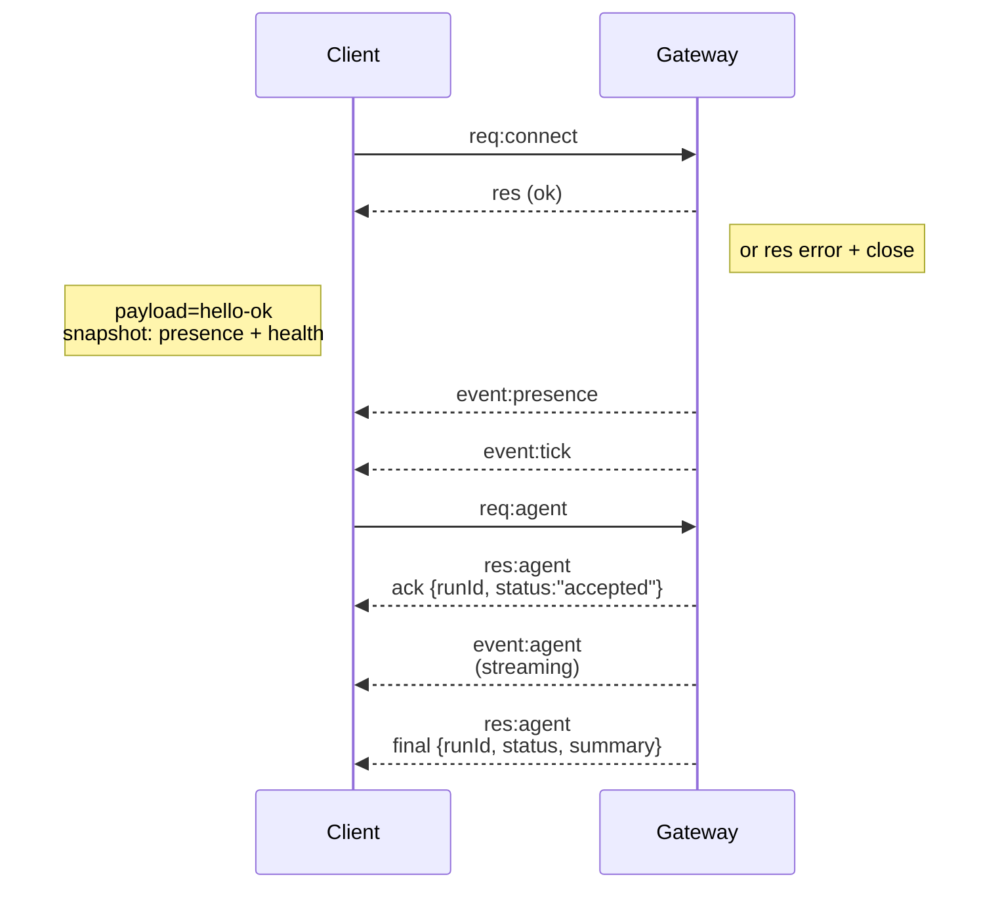

# 게이트웨이 아키텍처

## 개요

- 단일 장기 실행 **게이트웨이**가 모든 메시징 서피스를 소유합니다 (Baileys를 통한 WhatsApp, grammY를 통한 Telegram, Slack, Discord, Signal, iMessage, WebChat).
- 제어 플레인 클라이언트 (macOS 앱, CLI, 웹 UI, 자동화)는 구성된 바인드 호스트 (기본값 `127.0.0.1:18789`)의 **WebSocket**을 통해 게이트웨이에 연결합니다.
- **노드** (macOS/iOS/Android/헤드리스)도 **WebSocket**을 통해 연결하지만, 명시적 캡스/커맨드와 함께 `role: node`를 선언합니다.
- 호스트당 하나의 게이트웨이; 이는 WhatsApp 세션을 여는 유일한 곳입니다.
- **canvas 호스트**는 게이트웨이 HTTP 서버에서 다음 경로로 제공됩니다:
  - `/__openclaw__/canvas/` (에이전트 편집 가능 HTML/CSS/JS)
  - `/__openclaw__/a2ui/` (A2UI 호스트)
    게이트웨이와 동일한 포트 (기본값 `18789`)를 사용합니다.

## 컴포넌트와 흐름

### 게이트웨이 (데몬)

- 프로바이더 연결을 유지합니다.
- 타입화된 WS API를 노출합니다 (요청, 응답, 서버 푸시 이벤트).
- 인바운드 프레임을 JSON Schema에 대해 검증합니다.
- `agent`, `chat`, `presence`, `health`, `heartbeat`, `cron` 같은 이벤트를 방출합니다.

### 클라이언트 (mac 앱 / CLI / 웹 관리자)

- 클라이언트당 하나의 WS 연결.
- 요청 전송 (`health`, `status`, `send`, `agent`, `system-presence`).
- 이벤트 구독 (`tick`, `agent`, `presence`, `shutdown`).

### 노드 (macOS / iOS / Android / 헤드리스)

- `role: node`로 **동일한 WS 서버**에 연결합니다.
- `connect`에서 장치 ID를 제공합니다; 페어링은 **장치 기반** (역할 `node`)이며 승인은 장치 페어링 저장소에 있습니다.
- `canvas.*`, `camera.*`, `screen.record`, `location.get` 같은 커맨드를 노출합니다.

프로토콜 세부사항:

- [게이트웨이 프로토콜](/gateway/protocol)

### WebChat

- 채팅 히스토리 및 전송에 게이트웨이 WS API를 사용하는 정적 UI.
- 원격 설정에서 다른 클라이언트와 동일한 SSH/Tailscale 터널을 통해 연결합니다.

## 연결 생명주기 (단일 클라이언트)



## 와이어 프로토콜 (요약)

- 트랜스포트: WebSocket, JSON 페이로드가 있는 텍스트 프레임.
- 첫 번째 프레임은 반드시 `connect`이어야 합니다.
- 핸드셰이크 이후:
  - 요청: `{type:"req", id, method, params}` → `{type:"res", id, ok, payload|error}`
  - 이벤트: `{type:"event", event, payload, seq?, stateVersion?}`
- `hello-ok.features.methods` / `events`는 탐색 메타데이터이며, 모든 호출 가능한 헬퍼 라우트의 생성된 덤프가 아닙니다.
- 공유 시크릿 인증은 구성된 게이트웨이 인증 모드에 따라 `connect.params.auth.token` 또는 `connect.params.auth.password`를 사용합니다.
- Tailscale Serve (`gateway.auth.allowTailscale: true`) 또는 루프백이 아닌 `gateway.auth.mode: "trusted-proxy"` 같은 ID 전달 모드는 `connect.params.auth.*` 대신 요청 헤더에서 인증을 충족합니다.
- 비공개 인그레스 `gateway.auth.mode: "none"`은 공유 시크릿 인증을 완전히 비활성화합니다; 공개/신뢰할 수 없는 인그레스에서는 이 모드를 끄십시오.
- 멱등성 키는 부작용이 있는 메서드 (`send`, `agent`)에서 안전한 재시도를 위해 필요합니다; 서버는 단기 중복 제거 캐시를 유지합니다.
- 노드는 `connect`에서 `role: "node"` 및 캡스/커맨드/퍼미션을 포함해야 합니다.

## 페어링 + 로컬 신뢰

- 모든 WS 클라이언트 (오퍼레이터 + 노드)는 `connect`에서 **장치 ID**를 포함합니다.
- 새 장치 ID는 페어링 승인이 필요합니다; 게이트웨이는 후속 연결을 위해 **장치 토큰**을 발행합니다.
- 직접 로컬 루프백 연결은 동일 호스트 UX를 원활하게 유지하기 위해 자동 승인될 수 있습니다.
- OpenClaw에는 신뢰할 수 있는 공유 시크릿 헬퍼 흐름을 위한 좁은 백엔드/컨테이너 로컬 자체 연결 경로도 있습니다.
- 동일 호스트 tailnet 바인드를 포함한 Tailnet 및 LAN 연결은 여전히 명시적 페어링 승인이 필요합니다.
- 모든 연결은 `connect.challenge` 논스에 서명해야 합니다.
- 서명 페이로드 `v3`는 `platform` + `deviceFamily`도 바인딩합니다; 게이트웨이는 재연결 시 페어링된 메타데이터를 고정하고 메타데이터 변경에 대한 재페어링이 필요합니다.
- **비로컬** 연결은 여전히 명시적 승인이 필요합니다.
- 게이트웨이 인증 (`gateway.auth.*`)은 로컬이든 원격이든 **모든** 연결에 적용됩니다.

세부사항: [게이트웨이 프로토콜](/gateway/protocol), [페어링](/channels/pairing), [보안](/gateway/security/).

## 프로토콜 타이핑 및 코드 생성

- TypeBox 스키마가 프로토콜을 정의합니다.
- JSON Schema는 해당 스키마에서 생성됩니다.
- Swift 모델은 JSON Schema에서 생성됩니다.

## 원격 액세스

- 권장: Tailscale 또는 VPN.
- 대안: SSH 터널

  ```bash
  ssh -N -L 18789:127.0.0.1:18789 user@host
  ```

- 동일한 핸드셰이크 + 인증 토큰이 터널을 통해 적용됩니다.
- TLS + 선택적 고정이 원격 설정의 WS에서 활성화될 수 있습니다.

## 운영 스냅샷

- 시작: `openclaw gateway` (포그라운드, stdout에 로깅).
- 헬스: WS를 통한 `health` (`hello-ok`에도 포함됨).
- 감독: 자동 재시작을 위한 launchd/systemd.

## 불변성

- 정확히 하나의 게이트웨이가 호스트당 단일 Baileys 세션을 제어합니다.
- 핸드셰이크는 필수입니다; JSON이 아니거나 connect가 아닌 첫 번째 프레임은 하드 클로즈입니다.
- 이벤트는 재생되지 않습니다; 클라이언트는 갭이 있을 때 새로 고쳐야 합니다.

## 관련 항목

- [에이전트 루프](/concepts/agent-loop) — 상세 에이전트 실행 사이클
- [게이트웨이 프로토콜](/gateway/protocol) — WebSocket 프로토콜 계약
- [큐](/concepts/queue) — 커맨드 큐 및 동시성
- [보안](/gateway/security/) — 신뢰 모델 및 강화
