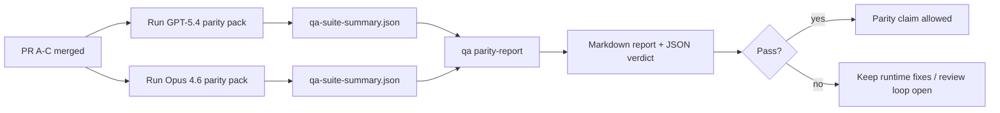

이 노트는 GPT-5.4 / Codex parity 프로그램을 원래의 6개 계약 아키텍처를 잃지 않으면서 네 개의 머지 단위로 리뷰하는 방법을 설명합니다.

## 머지 단위

### PR A: strict-agentic 실행

소유:

- `executionContract`
- GPT-5 우선의 같은 턴(same-turn) 후속 실행
- 비종결(non-terminal) 진행 추적 역할의 `update_plan`
- 계획만으로 조용히 멈추는 대신 명시적 blocked 상태

비소유:

- 인증/런타임 실패 분류
- 권한 진실성
- replay/continuation 재설계
- parity 벤치마킹

### PR B: 런타임 진실성

소유:

- Codex OAuth scope 정확성
- 타입드(typed) provider/runtime 실패 분류
- 진실한 `/elevated full` 가용성 및 blocked 이유

비소유:

- 도구 스키마 정규화
- replay/liveness 상태
- 벤치마크 게이팅

### PR C: 실행 정확성

소유:

- provider 소유 OpenAI/Codex 도구 호환성
- 파라미터 없는 strict 스키마 처리
- replay-invalid 노출
- paused, blocked, abandoned 장기 작업 상태 가시성

비소유:

- 자체 선택된(self-elected) continuation
- provider 훅 바깥의 일반적인 Codex 방언 동작
- 벤치마크 게이팅

### PR D: parity 하네스

소유:

- 첫 번째 웨이브 GPT-5.4 vs Opus 4.6 시나리오 팩
- parity 문서화
- parity 리포트 및 릴리스 게이트 메커니즘

비소유:

- QA 랩 외부의 런타임 동작 변경
- 하네스 내부의 인증/proxy/DNS 시뮬레이션

## 원래의 6개 계약으로의 매핑

| 원래 계약                                | 머지 단위 |
| ---------------------------------------- | --------- |
| Provider 전송/인증 정확성                | PR B      |
| 도구 계약/스키마 호환성                  | PR C      |
| 같은 턴 실행                             | PR A      |
| 권한 진실성                              | PR B      |
| Replay/continuation/liveness 정확성      | PR C      |
| 벤치마크/릴리스 게이트                   | PR D      |

## 리뷰 순서

1. PR A
2. PR B
3. PR C
4. PR D

PR D는 증명 계층(proof layer)입니다. 런타임 정확성 PR들이 지연되는 이유가 되어서는 안 됩니다.

## 확인할 사항

### PR A

- GPT-5 실행이 코멘트에서 멈추는 대신 행동하거나 fail closed로 종료됨
- `update_plan`이 그 자체로 진행처럼 보이지 않음
- 동작이 GPT-5 우선 및 임베디드 Pi 범위를 유지

### PR B

- 인증/proxy/런타임 실패가 일반적인 "model failed" 처리로 붕괴되는 것을 멈춤
- `/elevated full`이 실제로 사용 가능할 때에만 사용 가능한 것으로 설명됨
- blocked 이유가 모델과 사용자 대면 런타임 모두에서 보임

### PR C

- strict OpenAI/Codex 도구 등록이 예측 가능하게 동작
- 파라미터 없는 도구가 strict 스키마 검사에서 실패하지 않음
- replay 및 compaction 결과가 진실한 liveness 상태를 보존

### PR D

- 시나리오 팩이 이해 가능하고 재현 가능
- 팩이 읽기 전용 플로우뿐만 아니라 mutating replay-safety 레인을 포함
- 리포트가 사람과 자동화 모두에서 판독 가능
- parity 주장이 일화가 아닌 증거 기반

PR D의 예상 아티팩트:

- 각 모델 실행에 대한 `qa-suite-report.md` / `qa-suite-summary.json`
- 집계 및 시나리오 레벨 비교가 포함된 `qa-agentic-parity-report.md`
- 기계 판독 가능 verdict가 포함된 `qa-agentic-parity-summary.json`

## 릴리스 게이트

다음 조건이 모두 충족될 때까지 GPT-5.4의 Opus 4.6 대비 parity 또는 우위를 주장하지 마십시오:

- PR A, PR B, PR C가 병합됨
- PR D가 첫 번째 웨이브 parity 팩을 깔끔하게 실행함
- runtime-truthfulness 회귀 스위트가 그린 상태를 유지
- parity 리포트에 가짜 성공 케이스가 없고 정지 동작에 회귀가 없음

parity 하네스는 유일한 증거 소스가 아닙니다. 리뷰에서 이 분할을 명시적으로 유지하십시오:

- PR D는 시나리오 기반 GPT-5.4 vs Opus 4.6 비교를 소유
- PR B 결정적 스위트는 여전히 인증/proxy/DNS 및 전체 접근 진실성 증거를 소유

## 목표-증거 맵

| 완료 게이트 항목                         | 주 담당자     | 리뷰 아티팩트                                                         |
| ---------------------------------------- | ------------- | --------------------------------------------------------------------- |
| 계획만 있는 정체 없음                    | PR A          | strict-agentic 런타임 테스트 및 `approval-turn-tool-followthrough`    |
| 가짜 진행 또는 가짜 도구 완료 없음       | PR A + PR D   | parity fake-success 카운트 및 시나리오 레벨 리포트 세부사항           |
| 잘못된 `/elevated full` 안내 없음        | PR B          | 결정적 runtime-truthfulness 스위트                                    |
| replay/liveness 실패가 명시적으로 유지   | PR C + PR D   | 라이프사이클/replay 스위트 및 `compaction-retry-mutating-tool`        |
| GPT-5.4가 Opus 4.6과 동등하거나 그 이상  | PR D          | `qa-agentic-parity-report.md` 및 `qa-agentic-parity-summary.json`     |

## 리뷰어 단축 참조: 이전 vs 이후

| 이전의 사용자 가시 문제                                          | 이후의 리뷰 신호                                                                             |
| ---------------------------------------------------------------- | -------------------------------------------------------------------------------------------- |
| GPT-5.4가 계획 후 멈춤                                           | PR A가 코멘트만 있는 완료 대신 act-or-block 동작을 보여줌                                    |
| strict OpenAI/Codex 스키마에서 도구 사용이 취약하게 느껴짐       | PR C가 도구 등록 및 파라미터 없는 호출을 예측 가능하게 유지                                  |
| `/elevated full` 힌트가 때때로 오도됨                            | PR B가 안내를 실제 런타임 역량 및 blocked 이유에 연결                                        |
| 장기 작업이 replay/compaction 모호성 속으로 사라질 수 있었음     | PR C가 명시적 paused, blocked, abandoned, replay-invalid 상태를 방출                         |
| parity 주장이 일화적이었음                                       | PR D가 두 모델에 동일 시나리오 커버리지를 가진 리포트 + JSON verdict를 생성                  |

## 관련

- [GPT-5.4 / Codex agentic parity](/help/gpt54-codex-agentic-parity)
