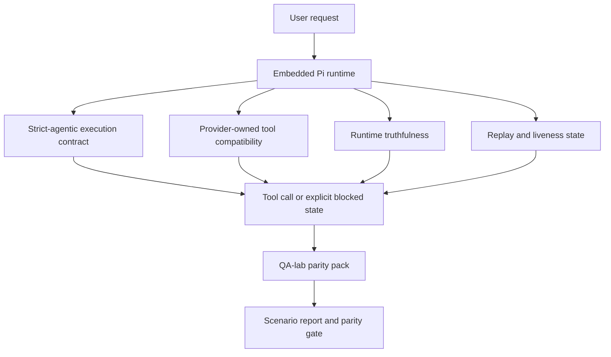
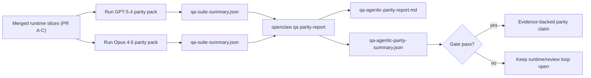

# OpenClaw의 GPT-5.4 / Codex Agentic Parity

OpenClaw는 이미 도구를 사용하는 프론티어 모델과 잘 작동했지만, GPT-5.4와 Codex 계열 모델은 여전히 몇 가지 실질적인 측면에서 기대에 못 미쳤습니다:

- 실제 작업을 수행하는 대신 계획(planning) 단계에서 멈출 수 있었습니다
- 엄격한(strict) OpenAI/Codex 도구 스키마를 잘못 사용할 수 있었습니다
- 전체 접근(full access)이 불가능한 상황에서도 `/elevated full`을 요청할 수 있었습니다
- replay 또는 compaction 중에 장시간 실행 작업의 상태를 잃을 수 있었습니다
- Claude Opus 4.6 대비 parity 주장이 반복 가능한 시나리오가 아닌 일화(anecdote)에 기반했습니다

이번 parity 프로그램은 이러한 격차를 검토 가능한 네 개의 슬라이스로 수정합니다.

## 변경 사항

### PR A: strict-agentic 실행

이 슬라이스는 임베디드 Pi GPT-5 실행을 위한 옵트인 `strict-agentic` 실행 계약(execution contract)을 추가합니다.

활성화되면 OpenClaw는 계획만 제시한 턴(plan-only turn)을 "충분히 좋은" 완료로 받아들이지 않습니다. 모델이 의도만 말하고 실제로 도구를 사용하거나 진행을 만들지 않으면, OpenClaw는 "지금 실행(act-now)" 유도로 재시도한 뒤 작업을 조용히 종료하는 대신 명시적인 blocked 상태로 fail-closed 처리합니다.

이 변경은 다음 상황에서 GPT-5.4 경험을 가장 크게 개선합니다:

- 짧은 "ok do it" 후속 턴
- 첫 번째 단계가 명확한 코드 작업
- `update_plan`이 채우기(filler) 텍스트가 아닌 진행 상황 추적 역할을 해야 하는 플로우

### PR B: 런타임 진실성(runtime truthfulness)

이 슬라이스는 OpenClaw가 두 가지에 대해 진실을 말하도록 만듭니다:

- provider/runtime 호출이 왜 실패했는지
- `/elevated full`이 실제로 사용 가능한지

즉, GPT-5.4가 누락된 scope, 인증 갱신 실패, HTML 403 인증 실패, proxy 문제, DNS 또는 timeout 실패, 차단된 전체 접근 모드에 대한 더 나은 런타임 신호를 얻게 됩니다. 모델이 잘못된 해결책을 환각하거나 런타임이 제공할 수 없는 권한 모드를 계속 요청할 가능성이 줄어듭니다.

### PR C: 실행 정확성

이 슬라이스는 두 가지 종류의 정확성을 개선합니다:

- provider 소유의 OpenAI/Codex 도구 스키마 호환성
- replay 및 장기 작업 생존성(liveness) 노출

도구 호환성 작업은 엄격한 OpenAI/Codex 도구 등록, 특히 파라미터 없는 도구와 엄격한 object-root 기대치 주변의 스키마 마찰을 줄입니다. replay/liveness 작업은 장시간 실행되는 작업을 더 관찰 가능하게 만들어, paused, blocked, abandoned 상태가 일반적인 실패 텍스트로 사라지지 않고 보이도록 합니다.

### PR D: parity 하네스(harness)

이 슬라이스는 첫 번째 웨이브의 QA 랩 parity 팩을 추가하여, GPT-5.4와 Opus 4.6이 동일한 시나리오로 실행되고 공유된 증거를 사용하여 비교될 수 있도록 합니다.

parity 팩은 증명 계층(proof layer)입니다. 이 자체로는 런타임 동작을 변경하지 않습니다.

두 개의 `qa-suite-summary.json` 아티팩트를 확보한 후 다음 명령으로 릴리스 게이트 비교를 생성하십시오:

```bash
pnpm openclaw qa parity-report \
  --repo-root . \
  --candidate-summary .artifacts/qa-e2e/gpt54/qa-suite-summary.json \
  --baseline-summary .artifacts/qa-e2e/opus46/qa-suite-summary.json \
  --output-dir .artifacts/qa-e2e/parity
```

해당 명령은 다음을 작성합니다:

- 사람이 읽을 수 있는 마크다운 리포트
- 기계가 읽을 수 있는 JSON verdict
- 명시적인 `pass` / `fail` 게이트 결과

## 실제로 GPT-5.4를 개선하는 이유

이 작업 이전에, OpenClaw에서 GPT-5.4는 실제 코딩 세션에서 Opus보다 덜 agentic하게 느껴질 수 있었습니다. 런타임이 GPT-5 계열 모델에게 특히 해로운 동작을 허용했기 때문입니다:

- 코멘트만 있는 턴(commentary-only turns)
- 도구 주변의 스키마 마찰
- 모호한 권한 피드백
- 조용한 replay 또는 compaction 중단

목표는 GPT-5.4가 Opus를 모방하도록 만드는 것이 아닙니다. 목표는 GPT-5.4에게 실제 진행을 보상하고, 더 깔끔한 도구 및 권한 semantics를 제공하며, 실패 모드를 명시적인 기계 및 사람 판독 가능 상태로 전환하는 런타임 계약을 제공하는 것입니다.

이는 사용자 경험을 다음과 같이 바꿉니다:

- "모델에게 좋은 계획이 있었지만 멈췄다"

에서

- "모델이 실제로 행동했거나, OpenClaw가 실행할 수 없는 정확한 이유를 노출했다"

로 변화시킵니다.

## GPT-5.4 사용자 관점: 이전 vs 이후

| 이 프로그램 이전                                                                           | PR A-D 이후                                                                             |
| ------------------------------------------------------------------------------------------ | --------------------------------------------------------------------------------------- |
| GPT-5.4가 합리적인 계획 이후 다음 도구 단계를 수행하지 않고 멈출 수 있었음                 | PR A가 "계획만"을 "지금 실행하거나 blocked 상태 노출"로 전환                             |
| 엄격한 도구 스키마가 파라미터 없는 또는 OpenAI/Codex 형태의 도구를 혼란스럽게 거부할 수 있었음 | PR C는 provider 소유 도구 등록과 호출을 더 예측 가능하게 만듦                           |
| 차단된 런타임에서 `/elevated full` 안내가 모호하거나 잘못될 수 있었음                      | PR B는 GPT-5.4와 사용자에게 진실한 런타임 및 권한 힌트를 제공                           |
| replay 또는 compaction 실패가 작업이 조용히 사라진 것처럼 느껴질 수 있었음                 | PR C는 paused, blocked, abandoned, replay-invalid 결과를 명시적으로 노출                |
| "GPT-5.4가 Opus보다 못하다"는 주장이 대부분 일화(anecdotal)적이었음                        | PR D가 이를 동일한 시나리오 팩, 동일한 메트릭, 하드 pass/fail 게이트로 전환              |

## 아키텍처



## 릴리스 플로우



## 시나리오 팩

첫 번째 웨이브 parity 팩은 현재 다섯 가지 시나리오를 다룹니다:

### `approval-turn-tool-followthrough`

짧은 승인 이후 모델이 "I'll do that"에서 멈추지 않는지 확인합니다. 같은 턴 내에서 첫 번째 구체적인 행동을 취해야 합니다.

### `model-switch-tool-continuity`

model/runtime 전환 경계에서도 도구를 사용하는 작업이 코멘트로 리셋되거나 실행 컨텍스트를 잃지 않고 일관성을 유지하는지 확인합니다.

### `source-docs-discovery-report`

모델이 소스 코드와 문서를 읽고, 발견 사항을 종합하며, 얇은 요약을 만들어 일찍 멈추는 대신 agentic하게 작업을 계속할 수 있는지 확인합니다.

### `image-understanding-attachment`

첨부 파일을 포함한 혼합 모드 작업이 여전히 실행 가능한 상태를 유지하며 모호한 내러티브로 붕괴하지 않는지 확인합니다.

### `compaction-retry-mutating-tool`

실제 mutating 쓰기가 있는 작업이 실행이 compaction, 재시도, 또는 부하 상황에서 reply 상태를 잃더라도 replay-unsafe 상태를 조용히 replay-safe인 것처럼 보이게 하지 않고 명시적으로 유지하는지 확인합니다.

## 시나리오 매트릭스

| 시나리오                           | 테스트 내용                                 | 좋은 GPT-5.4 동작                                                               | 실패 신호                                                                              |
| ---------------------------------- | ------------------------------------------- | ------------------------------------------------------------------------------- | -------------------------------------------------------------------------------------- |
| `approval-turn-tool-followthrough` | 계획 이후 짧은 승인 턴                      | 의도를 재진술하는 대신 즉시 첫 번째 구체적 도구 행동을 시작                     | 계획만 있는 후속 턴, 도구 활동 없음, 또는 실제 blocker 없이 blocked 턴                |
| `model-switch-tool-continuity`     | 도구 사용 중 runtime/model 전환             | 작업 컨텍스트를 보존하고 일관되게 행동 지속                                     | 코멘트로 리셋, 도구 컨텍스트 손실, 또는 전환 후 정지                                   |
| `source-docs-discovery-report`     | 소스 읽기 + 종합 + 행동                     | 소스를 찾고, 도구를 사용하며, 정체되지 않고 유용한 리포트 생성                  | 얇은 요약, 도구 작업 누락, 또는 불완전한 턴에서 정지                                   |
| `image-understanding-attachment`   | 첨부 기반 agentic 작업                      | 첨부를 해석하고, 도구에 연결하며, 작업 지속                                     | 모호한 내러티브, 첨부 무시, 또는 구체적 다음 행동 없음                                 |
| `compaction-retry-mutating-tool`   | compaction 부하에서의 mutating 작업         | 실제 쓰기를 수행하고 부수 효과 후에도 replay-unsafe 상태를 명시적으로 유지      | mutating 쓰기는 발생하지만 replay 안전성이 암시적이거나, 누락되거나, 모순됨            |

## 릴리스 게이트

GPT-5.4는 병합된 런타임이 parity 팩과 runtime-truthfulness 회귀(regression) 모두를 동시에 통과할 때에만 parity 또는 그 이상으로 간주될 수 있습니다.

필수 결과:

- 다음 도구 행동이 명확할 때 계획만으로 멈추는 현상 없음
- 실제 실행 없는 가짜 완료 없음
- 잘못된 `/elevated full` 안내 없음
- 조용한 replay 또는 compaction 포기 없음
- 합의된 Opus 4.6 베이스라인 이상으로 강력한 parity 팩 메트릭

첫 번째 웨이브 하네스의 경우 게이트는 다음을 비교합니다:

- completion rate (완료율)
- unintended-stop rate (의도치 않은 정지율)
- valid-tool-call rate (유효 도구 호출율)
- fake-success count (가짜 성공 횟수)

Parity 증거는 의도적으로 두 계층으로 나뉩니다:

- PR D는 QA 랩으로 동일 시나리오의 GPT-5.4 vs Opus 4.6 동작을 증명
- PR B 결정적(deterministic) 스위트는 하네스 외부에서 인증, proxy, DNS, `/elevated full` 진실성을 증명

## 목표-증거 매트릭스

| 완료 게이트 항목                                               | 담당 PR      | 증거 소스                                                              | 통과 신호                                                                                  |
| -------------------------------------------------------------- | ------------ | ---------------------------------------------------------------------- | ------------------------------------------------------------------------------------------ |
| GPT-5.4가 계획 후 정체되지 않음                                | PR A         | `approval-turn-tool-followthrough` 및 PR A 런타임 스위트               | 승인 턴이 실제 작업 또는 명시적 blocked 상태를 트리거                                     |
| GPT-5.4가 가짜 진행 또는 가짜 도구 완료를 만들지 않음          | PR A + PR D  | parity 리포트 시나리오 결과 및 fake-success 카운트                     | 의심스러운 pass 결과 없음, 코멘트만 있는 완료 없음                                         |
| GPT-5.4가 잘못된 `/elevated full` 안내를 제공하지 않음         | PR B         | 결정적 truthfulness 스위트                                             | blocked 이유와 전체 접근 힌트가 런타임에 정확하게 유지됨                                   |
| replay/liveness 실패가 명시적으로 유지됨                        | PR C + PR D  | PR C 라이프사이클/replay 스위트 + `compaction-retry-mutating-tool`     | mutating 작업이 조용히 사라지는 대신 replay-unsafe 상태를 명시적으로 유지                  |
| GPT-5.4가 합의된 메트릭에서 Opus 4.6과 동등하거나 그 이상      | PR D         | `qa-agentic-parity-report.md` 및 `qa-agentic-parity-summary.json`      | 동일 시나리오 커버리지, 완료율/정지 동작/유효 도구 사용에서 회귀 없음                      |

## Parity verdict를 읽는 방법

`qa-agentic-parity-summary.json`의 verdict를 첫 번째 웨이브 parity 팩의 최종 기계 판독 가능 결정으로 사용하십시오.

- `pass`는 GPT-5.4가 Opus 4.6과 동일한 시나리오를 다뤘고 합의된 집계 메트릭에서 회귀하지 않았음을 의미합니다.
- `fail`은 하드 게이트 중 하나 이상이 작동했음을 의미합니다: 약한 완료율, 더 나쁜 의도치 않은 정지, 약한 유효 도구 사용, 가짜 성공 케이스, 또는 일치하지 않는 시나리오 커버리지.
- "shared/base CI 문제"는 그 자체로 parity 결과가 아닙니다. PR D 외부의 CI 노이즈가 실행을 차단하면, verdict는 브랜치 시절 로그에서 추론되지 않고 깔끔한 병합 런타임 실행을 기다려야 합니다.
- 인증, proxy, DNS 및 `/elevated full` 진실성은 여전히 PR B의 결정적 스위트에서 나오므로 최종 릴리스 주장에는 두 가지 모두 필요합니다: 통과한 PR D parity verdict와 그린 PR B truthfulness 커버리지.

## `strict-agentic`을 활성화해야 하는 대상

다음 경우에 `strict-agentic`을 사용하십시오:

- 다음 단계가 명확할 때 에이전트가 즉시 행동하기를 기대하는 경우
- GPT-5.4 또는 Codex 계열 모델이 주 런타임인 경우
- "도움이 되는" 재요약만 있는 응답보다 명시적인 blocked 상태를 선호하는 경우

다음 경우에는 기본 계약을 유지하십시오:

- 기존의 느슨한 동작을 원하는 경우
- GPT-5 계열 모델을 사용하지 않는 경우
- 런타임 시행이 아닌 프롬프트를 테스트하는 경우

## 관련

- [GPT-5.4 / Codex parity 유지보수자 노트](/help/gpt54-codex-agentic-parity-maintainers)
