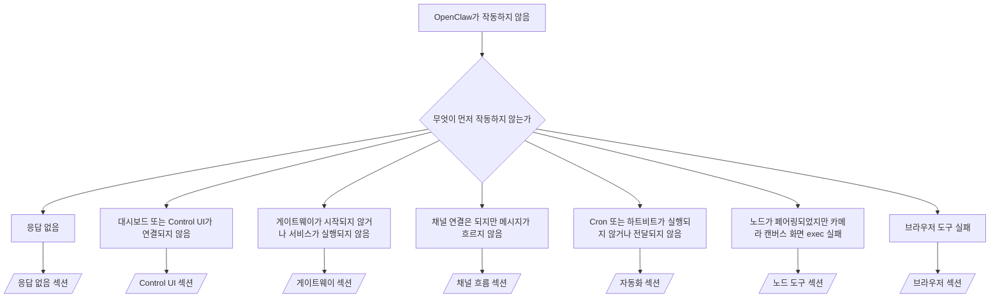

# 문제 해결

2분 밖에 없다면 이 페이지를 분류 입구로 사용하십시오.

## 처음 60초

이 순서대로 정확히 실행하십시오:

```bash
openclaw status
openclaw status --all
openclaw gateway probe
openclaw gateway status
openclaw doctor
openclaw channels status --probe
openclaw logs --follow
```

한 줄로 본 정상 출력:

- `openclaw status` → 구성된 채널이 표시되고 명백한 인증 오류가 없습니다.
- `openclaw status --all` → 전체 보고서가 있으며 공유 가능합니다.
- `openclaw gateway probe` → 예상 게이트웨이 대상에 도달할 수 있습니다 (`Reachable: yes`). `RPC: limited - missing scope: operator.read`는 연결 실패가 아닌 진단 기능 저하 상태입니다.
- `openclaw gateway status` → `Runtime: running`이고 `RPC probe: ok`입니다.
- `openclaw doctor` → 차단 중인 구성/서비스 오류가 없습니다.
- `openclaw channels status --probe` → 도달 가능한 게이트웨이는 `works` 또는 `audit ok` 같은 실시간 계정별 전송 상태와 프로브/감사 결과를 반환합니다. 게이트웨이에 도달할 수 없는 경우 명령이 구성 전용 요약으로 폴백합니다.
- `openclaw logs --follow` → 꾸준한 활동이 있으며 반복적인 치명적 오류가 없습니다.

## Anthropic 긴 컨텍스트 429

다음 오류가 표시되는 경우:
`HTTP 429: rate_limit_error: Extra usage is required for long context requests`,
[/gateway/troubleshooting#anthropic-429-extra-usage-required-for-long-context](/gateway/troubleshooting#anthropic-429-extra-usage-required-for-long-context)로 이동하십시오.

## 로컬 OpenAI 호환 백엔드가 직접 작동하지만 OpenClaw에서 실패하는 경우

로컬 또는 자체 호스팅된 `/v1` 백엔드가 소규모 직접 `/v1/chat/completions` 프로브에는 응답하지만 `openclaw infer model run` 또는 일반 에이전트 턴에서 실패하는 경우:

1. 오류에 `messages[].content`가 문자열을 예상한다는 내용이 있으면 `models.providers.<provider>.models[].compat.requiresStringContent: true`를 설정하십시오.
2. 백엔드가 OpenClaw 에이전트 턴에서만 계속 실패하는 경우 `models.providers.<provider>.models[].compat.supportsTools: false`를 설정하고 다시 시도하십시오.
3. 소규모 직접 호출은 여전히 작동하지만 더 큰 OpenClaw 프롬프트가 백엔드를 충돌시키는 경우 나머지 문제를 업스트림 모델/서버 제한으로 처리하고 상세 런북에서 계속하십시오:
   [/gateway/troubleshooting#local-openai-compatible-backend-passes-direct-probes-but-agent-runs-fail](/gateway/troubleshooting#local-openai-compatible-backend-passes-direct-probes-but-agent-runs-fail)

## openclaw 확장이 없어서 플러그인 설치 실패

`package.json missing openclaw.extensions` 오류와 함께 설치가 실패하면 플러그인 패키지가 OpenClaw에서 더 이상 허용하지 않는 이전 형태를 사용하고 있는 것입니다.

플러그인 패키지에서 수정하십시오:

1. `package.json`에 `openclaw.extensions`를 추가하십시오.
2. 항목이 빌드된 런타임 파일(일반적으로 `./dist/index.js`)을 가리키도록 하십시오.
3. 플러그인을 다시 게시하고 `openclaw plugins install <package>`를 다시 실행하십시오.

예시:

```json
{
  "name": "@openclaw/my-plugin",
  "version": "1.2.3",
  "openclaw": {
    "extensions": ["./dist/index.js"]
  }
}
```

참조: [플러그인 아키텍처](/plugins/architecture)

## 결정 트리



<AccordionGroup>
  <Accordion title="응답 없음">
    ```bash
    openclaw status
    openclaw gateway status
    openclaw channels status --probe
    openclaw pairing list --channel <channel> [--account <id>]
    openclaw logs --follow
    ```

    정상 출력 예:

    - `Runtime: running`
    - `RPC probe: ok`
    - 채널이 전송 연결되어 있고 지원되는 경우 `channels status --probe`에서 `works` 또는 `audit ok` 표시
    - 발신자가 승인됨 (또는 DM 정책이 개방/허용 목록)

    일반적인 로그 서명:

    - `drop guild message (mention required` → Discord에서 멘션 게이팅이 메시지를 차단했습니다.
    - `pairing request` → 발신자가 승인되지 않아 DM 페어링 승인을 기다리고 있습니다.
    - `blocked` / `allowlist` (채널 로그) → 발신자, 방 또는 그룹이 필터링되었습니다.

    상세 페이지:

    - [/gateway/troubleshooting#no-replies](/gateway/troubleshooting#no-replies)
    - [/channels/troubleshooting](/channels/troubleshooting)
    - [/channels/pairing](/channels/pairing)

  </Accordion>

  <Accordion title="대시보드 또는 Control UI가 연결되지 않음">
    ```bash
    openclaw status
    openclaw gateway status
    openclaw logs --follow
    openclaw doctor
    openclaw channels status --probe
    ```

    정상 출력 예:

    - `openclaw gateway status`에 `Dashboard: http://...`가 표시됨
    - `RPC probe: ok`
    - 로그에 인증 루프 없음

    일반적인 로그 서명:

    - `device identity required` → HTTP/비보안 컨텍스트에서 기기 인증을 완료할 수 없습니다.
    - `origin not allowed` → 브라우저 `Origin`이 Control UI 게이트웨이 대상으로 허용되지 않습니다.
    - `AUTH_TOKEN_MISMATCH` with retry hints (`canRetryWithDeviceToken=true`) → 신뢰할 수 있는 기기 토큰 재시도가 자동으로 한 번 발생할 수 있습니다.
    - 캐시된 토큰 재시도는 페어링된 기기 토큰과 함께 저장된 캐시된 범위 세트를 재사용합니다. 명시적 `deviceToken` / 명시적 `scopes` 호출자는 요청한 범위 세트를 유지합니다.
    - 비동기 Tailscale Serve Control UI 경로에서 동일한 `{scope, ip}`에 대한 실패한 시도는 제한기가 실패를 기록하기 전에 직렬화되므로 두 번째 동시 재시도는 이미 `retry later`를 표시할 수 있습니다.
    - localhost 브라우저 origin에서 `too many failed authentication attempts (retry later)` → 동일한 `Origin`에서의 반복 실패가 일시적으로 잠겼습니다. 다른 localhost origin은 별도의 버킷을 사용합니다.
    - 재시도 후 반복되는 `unauthorized` → 잘못된 토큰/비밀번호, 인증 모드 불일치, 또는 오래된 페어링된 기기 토큰.
    - `gateway connect failed:` → UI가 잘못된 URL/포트를 대상으로 하거나 게이트웨이에 도달할 수 없습니다.

    상세 페이지:

    - [/gateway/troubleshooting#dashboard-control-ui-connectivity](/gateway/troubleshooting#dashboard-control-ui-connectivity)
    - [/web/control-ui](/web/control-ui)
    - [/gateway/authentication](/gateway/authentication)

  </Accordion>

  <Accordion title="게이트웨이가 시작되지 않거나 서비스가 설치되었지만 실행되지 않음">
    ```bash
    openclaw status
    openclaw gateway status
    openclaw logs --follow
    openclaw doctor
    openclaw channels status --probe
    ```

    정상 출력 예:

    - `Service: ... (loaded)`
    - `Runtime: running`
    - `RPC probe: ok`

    일반적인 로그 서명:

    - `Gateway start blocked: set gateway.mode=local` 또는 `existing config is missing gateway.mode` → 게이트웨이 모드가 remote이거나 구성 파일에 로컬 모드 스탬프가 없어 수정이 필요합니다.
    - `refusing to bind gateway ... without auth` → 유효한 게이트웨이 인증 경로(토큰/비밀번호, 또는 구성된 경우 trusted-proxy) 없이 비루프백 바인딩을 거부합니다.
    - `another gateway instance is already listening` 또는 `EADDRINUSE` → 포트가 이미 사용 중입니다.

    상세 페이지:

    - [/gateway/troubleshooting#gateway-service-not-running](/gateway/troubleshooting#gateway-service-not-running)
    - [/gateway/background-process](/gateway/background-process)
    - [/gateway/configuration](/gateway/configuration)

  </Accordion>

  <Accordion title="채널 연결은 되지만 메시지가 흐르지 않음">
    ```bash
    openclaw status
    openclaw gateway status
    openclaw logs --follow
    openclaw doctor
    openclaw channels status --probe
    ```

    정상 출력 예:

    - 채널 전송이 연결되어 있습니다.
    - 페어링/허용 목록 확인이 통과합니다.
    - 필요한 경우 멘션이 감지됩니다.

    일반적인 로그 서명:

    - `mention required` → 그룹 멘션 게이팅이 처리를 차단했습니다.
    - `pairing` / `pending` → DM 발신자가 아직 승인되지 않았습니다.
    - `not_in_channel`, `missing_scope`, `Forbidden`, `401/403` → 채널 권한 토큰 문제.

    상세 페이지:

    - [/gateway/troubleshooting#channel-connected-messages-not-flowing](/gateway/troubleshooting#channel-connected-messages-not-flowing)
    - [/channels/troubleshooting](/channels/troubleshooting)

  </Accordion>

  <Accordion title="Cron 또는 하트비트가 실행되지 않거나 전달되지 않음">
    ```bash
    openclaw status
    openclaw gateway status
    openclaw cron status
    openclaw cron list
    openclaw cron runs --id <jobId> --limit 20
    openclaw logs --follow
    ```

    정상 출력 예:

    - `cron.status`가 활성화되어 있고 다음 실행 시간이 표시됩니다.
    - `cron runs`에 최근 `ok` 항목이 표시됩니다.
    - 하트비트가 활성화되어 있고 활성 시간 밖에 있지 않습니다.

    일반적인 로그 서명:

- `cron: scheduler disabled; jobs will not run automatically` → cron이 비활성화되어 있습니다.
- `heartbeat skipped` with `reason=quiet-hours` → 구성된 활성 시간 밖에 있습니다.
- `heartbeat skipped` with `reason=empty-heartbeat-file` → `HEARTBEAT.md`가 존재하지만 빈/헤더만 있는 스캐폴딩만 포함되어 있습니다.
- `heartbeat skipped` with `reason=no-tasks-due` → `HEARTBEAT.md` 작업 모드가 활성화되어 있지만 아직 기한이 된 작업 간격이 없습니다.
- `heartbeat skipped` with `reason=alerts-disabled` → 모든 하트비트 가시성이 비활성화되어 있습니다 (`showOk`, `showAlerts`, `useIndicator`가 모두 꺼져 있음).
- `requests-in-flight` → 메인 레인이 바쁩니다. 하트비트 실행이 지연되었습니다. - `unknown accountId` → 하트비트 전달 대상 계정이 존재하지 않습니다.

      상세 페이지:

      - [/gateway/troubleshooting#cron-and-heartbeat-delivery](/gateway/troubleshooting#cron-and-heartbeat-delivery)
      - [/automation/cron-jobs#troubleshooting](/automation/cron-jobs#troubleshooting)
      - [/gateway/heartbeat](/gateway/heartbeat)

    </Accordion>

    <Accordion title="노드가 페어링되었지만 도구 카메라 캔버스 화면 exec 실패">
      ```bash
      openclaw status
      openclaw gateway status
      openclaw nodes status
      openclaw nodes describe --node <idOrNameOrIp>
      openclaw logs --follow
      ```

      정상 출력 예:

      - 노드가 `node` 역할로 연결되어 페어링되어 있습니다.
      - 호출하려는 명령에 대한 기능이 존재합니다.
      - 도구에 대한 권한 상태가 부여되어 있습니다.

      일반적인 로그 서명:

      - `NODE_BACKGROUND_UNAVAILABLE` → 노드 앱을 포그라운드로 가져오십시오.
      - `*_PERMISSION_REQUIRED` → OS 권한이 거부되거나 없습니다.
      - `SYSTEM_RUN_DENIED: approval required` → exec 승인이 대기 중입니다.
      - `SYSTEM_RUN_DENIED: allowlist miss` → 명령이 exec 허용 목록에 없습니다.

      상세 페이지:

      - [/gateway/troubleshooting#node-paired-tool-fails](/gateway/troubleshooting#node-paired-tool-fails)
      - [/nodes/troubleshooting](/nodes/troubleshooting)
      - [/tools/exec-approvals](/tools/exec-approvals)

    </Accordion>

    <Accordion title="Exec가 갑자기 승인을 요청함">
      ```bash
      openclaw config get tools.exec.host
      openclaw config get tools.exec.security
      openclaw config get tools.exec.ask
      openclaw gateway restart
      ```

      변경 사항:

      - `tools.exec.host`가 설정되지 않은 경우 기본값은 `auto`입니다.
      - `host=auto`는 샌드박스 런타임이 활성화된 경우 `sandbox`로, 그렇지 않으면 `gateway`로 확인됩니다.
      - `host=auto`는 라우팅 전용입니다. 프롬프트 없는 "YOLO" 동작은 gateway/node에서 `security=full` 및 `ask=off`에서 비롯됩니다.
      - `gateway` 및 `node`에서 설정되지 않은 `tools.exec.security`는 기본값 `full`입니다.
      - 설정되지 않은 `tools.exec.ask`는 기본값 `off`입니다.
      - 결과: 승인이 표시된다면 일부 호스트 로컬 또는 세션별 정책이 현재 기본값에서 exec를 강화한 것입니다.

      현재 기본 승인 없음 동작 복원:

      ```bash
      openclaw config set tools.exec.host gateway
      openclaw config set tools.exec.security full
      openclaw config set tools.exec.ask off
      openclaw gateway restart
      ```

      더 안전한 대안:

      - 안정적인 호스트 라우팅만 원하는 경우 `tools.exec.host=gateway`만 설정하십시오.
      - 호스트 exec는 원하지만 허용 목록 미스에 대한 검토를 원한다면 `security=allowlist`와 `ask=on-miss`를 사용하십시오.
      - `host=auto`가 다시 `sandbox`로 확인되도록 원한다면 샌드박스 모드를 활성화하십시오.

      일반적인 로그 서명:

      - `Approval required.` → 명령이 `/approve ...`를 기다리고 있습니다.
      - `SYSTEM_RUN_DENIED: approval required` → 노드 호스트 exec 승인이 대기 중입니다.
      - `exec host=sandbox requires a sandbox runtime for this session` → 암시적/명시적 샌드박스 선택이지만 샌드박스 모드가 꺼져 있습니다.

      상세 페이지:

      - [/tools/exec](/tools/exec)
      - [/tools/exec-approvals](/tools/exec-approvals)
      - [/gateway/security#runtime-expectation-drift](/gateway/security#runtime-expectation-drift)

    </Accordion>

    <Accordion title="브라우저 도구 실패">
      ```bash
      openclaw status
      openclaw gateway status
      openclaw browser status
      openclaw logs --follow
      openclaw doctor
      ```

      정상 출력 예:

      - 브라우저 상태에 `running: true`와 선택된 브라우저/프로필이 표시됩니다.
      - `openclaw`가 시작되거나 `user`가 로컬 Chrome 탭을 볼 수 있습니다.

      일반적인 로그 서명:

      - `unknown command "browser"` 또는 `unknown command 'browser'` → `plugins.allow`가 설정되어 있고 `browser`를 포함하지 않습니다.
      - `Failed to start Chrome CDP on port` → 로컬 브라우저 실행 실패.
      - `browser.executablePath not found` → 구성된 바이너리 경로가 잘못되었습니다.
      - `browser.cdpUrl must be http(s) or ws(s)` → 구성된 CDP URL이 지원되지 않는 스키마를 사용합니다.
      - `browser.cdpUrl has invalid port` → 구성된 CDP URL에 잘못된 포트가 있습니다.
      - `No Chrome tabs found for profile="user"` → Chrome MCP 연결 프로필에 열린 로컬 Chrome 탭이 없습니다.
      - `Remote CDP for profile "<name>" is not reachable` → 구성된 원격 CDP 엔드포인트가 이 호스트에서 도달할 수 없습니다.
      - `Browser attachOnly is enabled ... not reachable` 또는 `Browser attachOnly is enabled and CDP websocket ... is not reachable` → 연결 전용 프로필에 활성 CDP 대상이 없습니다.
      - 연결 전용 또는 원격 CDP 프로필에서 오래된 뷰포트/다크 모드/로케일/오프라인 재정의 → `openclaw browser stop --browser-profile <name>`을 실행하여 게이트웨이를 재시작하지 않고 활성 제어 세션을 닫고 에뮬레이션 상태를 해제하십시오.

      상세 페이지:

      - [/gateway/troubleshooting#browser-tool-fails](/gateway/troubleshooting#browser-tool-fails)
      - [/tools/browser#missing-browser-command-or-tool](/tools/browser#missing-browser-command-or-tool)
      - [/tools/browser-linux-troubleshooting](/tools/browser-linux-troubleshooting)
      - [/tools/browser-wsl2-windows-remote-cdp-troubleshooting](/tools/browser-wsl2-windows-remote-cdp-troubleshooting)

    </Accordion>
  </AccordionGroup>

## 관련

- [FAQ](/help/faq) — 자주 묻는 질문
- [게이트웨이 문제 해결](/gateway/troubleshooting) — 게이트웨이 관련 문제
- [Doctor](/gateway/doctor) — 자동화된 상태 확인 및 수리
- [채널 문제 해결](/channels/troubleshooting) — 채널 연결 문제
- [자동화 문제 해결](/automation/cron-jobs#troubleshooting) — cron 및 하트비트 문제
