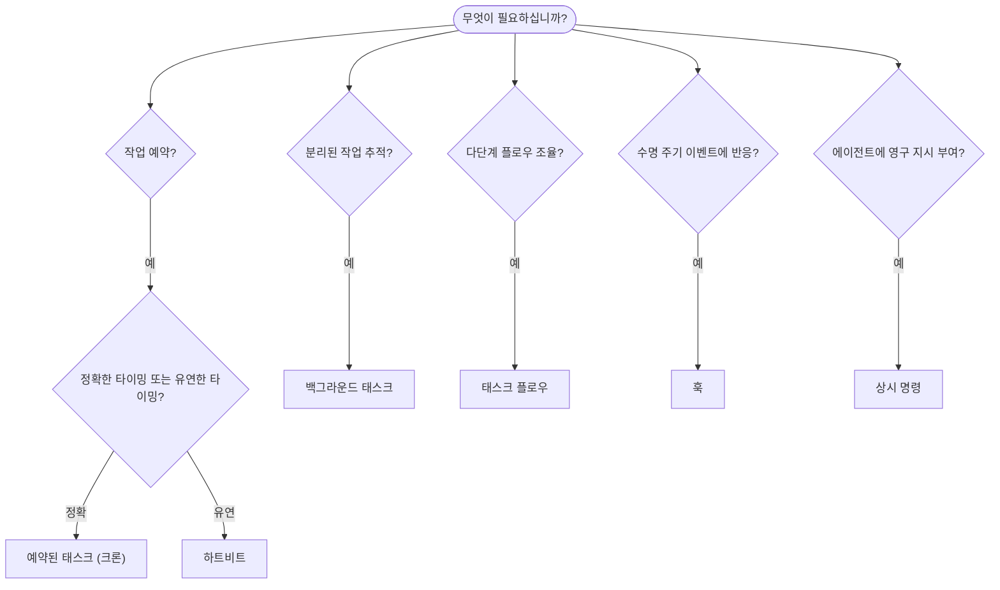

# 자동화 및 태스크

OpenClaw는 태스크, 예약된 작업, 이벤트 훅, 상시 지시를 통해 백그라운드에서 작업을 실행합니다. 이 페이지는 적합한 메커니즘을 선택하고 각 메커니즘이 어떻게 연동되는지 이해하는 데 도움을 줍니다.

## 빠른 결정 가이드

| 사용 사례                                 | 권장 방법              | 이유                                              |
| ----------------------------------------- | ---------------------- | ------------------------------------------------- |
| 오전 9시 정각에 일일 보고서 발송          | 예약된 태스크 (크론)   | 정확한 타이밍, 독립적 실행                        |
| 20분 후 알림                              | 예약된 태스크 (크론)   | `--at`을 사용한 정확한 타이밍의 일회성 실행       |
| 주간 심층 분석 실행                       | 예약된 태스크 (크론)   | 독립적인 태스크, 다른 모델 사용 가능              |
| 30분마다 받은 편지함 확인                 | 하트비트               | 다른 확인 작업과 배치, 컨텍스트 인식              |
| 임박한 일정을 위한 캘린더 모니터링        | 하트비트               | 주기적 인식에 자연스럽게 적합                     |
| 서브에이전트 또는 ACP 실행 상태 검사      | 백그라운드 태스크      | 태스크 원장이 분리된 모든 작업을 추적             |
| 실행 내용 및 시간 감사                    | 백그라운드 태스크      | `openclaw tasks list` 및 `openclaw tasks audit`   |
| 다단계 리서치 후 요약                     | 태스크 플로우          | 개정 추적이 포함된 내구성 있는 조율               |
| 세션 재설정 시 스크립트 실행              | 훅                     | 이벤트 기반, 수명 주기 이벤트 발생 시 실행        |
| 모든 도구 호출 시 코드 실행               | 훅                     | 훅은 이벤트 유형으로 필터링 가능                  |
| 응답 전 항상 규정 준수 확인               | 상시 명령              | 매 세션마다 자동으로 주입됨                       |

### 예약된 태스크 (크론) vs 하트비트

| 차원          | 예약된 태스크 (크론)                | 하트비트                              |
| ------------- | ----------------------------------- | ------------------------------------- |
| 타이밍        | 정확 (크론 표현식, 일회성)          | 근사치 (기본값 30분마다)              |
| 세션 컨텍스트 | 새로운 (독립) 또는 공유             | 메인 세션 전체 컨텍스트               |
| 태스크 레코드 | 항상 생성                           | 생성되지 않음                         |
| 전달          | 채널, 웹훅, 또는 자동 처리          | 메인 세션 내 인라인                   |
| 적합한 경우   | 보고서, 알림, 백그라운드 작업       | 받은 편지함 확인, 캘린더, 알림        |

정확한 타이밍이나 독립적 실행이 필요할 때는 예약된 태스크 (크론)를 사용하십시오. 작업이 전체 세션 컨텍스트의 이점을 활용하고 근사 타이밍으로 충분할 때는 하트비트를 사용하십시오.

## 핵심 개념

### 예약된 태스크 (크론)

크론은 정확한 타이밍을 위한 게이트웨이 내장 스케줄러입니다. 작업을 유지하고, 적시에 에이전트를 깨우며, 결과를 채팅 채널이나 웹훅 엔드포인트로 전달할 수 있습니다. 일회성 알림, 반복 표현식, 인바운드 웹훅 트리거를 지원합니다.

[예약된 태스크](/automation/cron-jobs)를 참조하십시오.

### 태스크

백그라운드 태스크 원장은 분리된 모든 작업을 추적합니다: ACP 실행, 서브에이전트 생성, 독립 크론 실행, CLI 작업. 태스크는 스케줄러가 아닌 레코드입니다. 검사하려면 `openclaw tasks list` 및 `openclaw tasks audit`를 사용하십시오.

[백그라운드 태스크](/automation/tasks)를 참조하십시오.

### 태스크 플로우

태스크 플로우는 백그라운드 태스크 위에 있는 플로우 조율 기반입니다. 관리형 및 미러링 동기화 모드, 개정 추적, 검사를 위한 `openclaw tasks flow list|show|cancel`을 통해 내구성 있는 다단계 플로우를 관리합니다.

[태스크 플로우](/automation/taskflow)를 참조하십시오.

### 상시 명령

상시 명령은 에이전트에게 정의된 프로그램에 대한 영구적인 운영 권한을 부여합니다. 작업 공간 파일(일반적으로 `AGENTS.md`)에 저장되며 매 세션마다 주입됩니다. 시간 기반 실행을 위해 크론과 결합하십시오.

[상시 명령](/automation/standing-orders)을 참조하십시오.

### 훅

훅은 에이전트 수명 주기 이벤트(`/new`, `/reset`, `/stop`), 세션 압축, 게이트웨이 시작, 메시지 플로우, 도구 호출에 의해 트리거되는 이벤트 기반 스크립트입니다. 훅은 디렉터리에서 자동으로 검색되며 `openclaw hooks`로 관리할 수 있습니다.

[훅](/automation/hooks)을 참조하십시오.

### 하트비트

하트비트는 주기적인 메인 세션 턴입니다 (기본값 30분마다). 전체 세션 컨텍스트를 사용하여 하나의 에이전트 턴에서 여러 확인 작업(받은 편지함, 캘린더, 알림)을 배치 처리합니다. 하트비트 턴은 태스크 레코드를 생성하지 않습니다. 간단한 체크리스트에는 `HEARTBEAT.md`를 사용하거나, 하트비트 내에서 기한이 지난 주기적 확인만 원할 때는 `tasks:` 블록을 사용하십시오. 빈 하트비트 파일은 `empty-heartbeat-file`로 건너뜁니다; 기한 전용 태스크 모드는 `no-tasks-due`로 건너뜁니다.

[하트비트](/gateway/heartbeat)를 참조하십시오.

## 연동 방식

- **크론**은 정확한 일정(일일 보고서, 주간 리뷰)과 일회성 알림을 처리합니다. 모든 크론 실행은 태스크 레코드를 생성합니다.
- **하트비트**는 30분마다 하나의 배치 턴으로 일상적인 모니터링(받은 편지함, 캘린더, 알림)을 처리합니다.
- **훅**은 사용자 정의 스크립트를 통해 특정 이벤트(도구 호출, 세션 재설정, 압축)에 반응합니다.
- **상시 명령**은 에이전트에게 지속적인 컨텍스트와 권한 경계를 제공합니다.
- **태스크 플로우**는 개별 태스크 위에서 다단계 플로우를 조율합니다.
- **태스크**는 분리된 모든 작업을 자동으로 추적하여 검사 및 감사할 수 있게 합니다.

## 관련 항목

- [예약된 태스크](/automation/cron-jobs) — 정확한 예약 및 일회성 알림
- [백그라운드 태스크](/automation/tasks) — 분리된 모든 작업을 위한 태스크 원장
- [태스크 플로우](/automation/taskflow) — 내구성 있는 다단계 플로우 조율
- [훅](/automation/hooks) — 이벤트 기반 수명 주기 스크립트
- [상시 명령](/automation/standing-orders) — 영구적인 에이전트 지시
- [하트비트](/gateway/heartbeat) — 주기적인 메인 세션 턴
- [설정 참조](/gateway/configuration-reference) — 모든 설정 키
