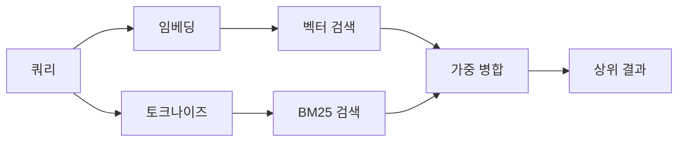

# 메모리 검색

`memory_search`는 표현이 원본 텍스트와 다를 때도 메모리 파일에서 관련 메모를 찾습니다. 메모리를 소규모 청크로 인덱싱하고 임베딩, 키워드, 또는 둘 다를 사용하여 검색합니다.

## 빠른 시작

OpenAI, Gemini, Voyage, 또는 Mistral API 키가 구성되어 있으면 메모리 검색이 자동으로 작동합니다. 프로바이더를 명시적으로 설정하려면:

```json5
{
  agents: {
    defaults: {
      memorySearch: {
        provider: "openai", // 또는 "gemini", "local", "ollama" 등
      },
    },
  },
}
```

API 키 없이 로컬 임베딩의 경우, `provider: "local"` (node-llama-cpp 필요)을 사용하십시오.

## 지원되는 프로바이더

| 프로바이더 | ID        | API 키 필요 | 참고                                                 |
| ---------- | --------- | ----------- | ---------------------------------------------------- |
| OpenAI     | `openai`  | 예          | 자동 감지, 빠름                                      |
| Gemini     | `gemini`  | 예          | 이미지/오디오 인덱싱 지원                            |
| Voyage     | `voyage`  | 예          | 자동 감지                                            |
| Mistral    | `mistral` | 예          | 자동 감지                                            |
| Bedrock    | `bedrock` | 아니오      | AWS 자격 증명 체인이 확인될 때 자동 감지             |
| Ollama     | `ollama`  | 아니오      | 로컬, 명시적으로 설정해야 함                         |
| Local      | `local`   | 아니오      | GGUF 모델, ~0.6 GB 다운로드                          |

## 검색 작동 방식

OpenClaw는 두 가지 검색 경로를 병렬로 실행하고 결과를 병합합니다:



- **벡터 검색**은 유사한 의미의 메모를 찾습니다 ("gateway host"는 "the machine running OpenClaw"에 매칭됩니다).
- **BM25 키워드 검색**은 정확한 매칭을 찾습니다 (ID, 오류 문자열, 구성 키).

하나의 경로만 사용 가능한 경우 (임베딩 없거나 FTS 없음), 다른 하나만 실행됩니다.

## 검색 품질 향상

메모 히스토리가 많을 때 도움이 되는 두 가지 선택적 기능이 있습니다:

### 시간 감쇠

오래된 메모는 점차 순위 가중치를 잃어 최근 정보가 먼저 표시됩니다. 기본 반감기 30일로, 지난달의 메모는 원래 가중치의 50%로 점수가 매겨집니다. `MEMORY.md`와 같은 상시 유효 파일은 절대 감쇠되지 않습니다.

::: tip
에이전트에 몇 달치 일별 메모가 있고 오래된 정보가 계속 최근 컨텍스트보다 높은 순위를 차지한다면 시간 감쇠를 활성화하십시오.
:::


### MMR (다양성)

중복 결과를 줄입니다. 동일한 라우터 구성을 언급하는 메모가 다섯 개 있는 경우, MMR은 상위 결과가 반복되는 대신 다른 주제를 다루도록 합니다.

::: tip
`memory_search`가 계속 다른 일별 메모에서 거의 중복된 스니펫을 반환한다면 MMR을 활성화하십시오.
:::


### 둘 다 활성화

```json5
{
  agents: {
    defaults: {
      memorySearch: {
        query: {
          hybrid: {
            mmr: { enabled: true },
            temporalDecay: { enabled: true },
          },
        },
      },
    },
  },
}
```

## 멀티모달 메모리

Gemini Embedding 2로 마크다운과 함께 이미지와 오디오 파일을 인덱싱할 수 있습니다. 검색 쿼리는 텍스트로 유지되지만, 시각적 및 오디오 콘텐츠에 매칭됩니다. 설정은 [메모리 구성 참조](/reference/memory-config)를 참조하십시오.

## 세션 메모리 검색

`memory_search`가 이전 대화를 회상할 수 있도록 선택적으로 세션 트랜스크립트를 인덱싱할 수 있습니다. 이는 `memorySearch.experimental.sessionMemory`를 통해 옵트인 방식입니다. 세부사항은 [구성 참조](/reference/memory-config)를 참조하십시오.

## 트러블슈팅

**결과 없음?** `openclaw memory status`를 실행하여 인덱스를 확인하십시오. 비어 있으면 `openclaw memory index --force`를 실행하십시오.

**키워드 매칭만 있습니까?** 임베딩 프로바이더가 구성되어 있지 않을 수 있습니다. `openclaw memory status --deep`을 확인하십시오.

**CJK 텍스트를 찾을 수 없습니까?** `openclaw memory index --force`로 FTS 인덱스를 재빌드하십시오.

## 추가 읽기

- [메모리](/concepts/memory) -- 파일 레이아웃, 백엔드, 도구
- [메모리 구성 참조](/reference/memory-config) -- 모든 구성 설정
