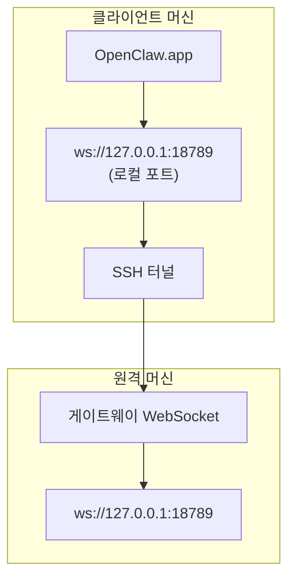

> 이 내용은 [원격 액세스](/gateway/remote#macos-persistent-ssh-tunnel-via-launchagent)에 통합되었습니다. 현재 가이드는 해당 페이지를 참조하십시오.

# 원격 게이트웨이로 OpenClaw.app 실행

OpenClaw.app은 SSH 터널링을 사용하여 원격 게이트웨이에 연결합니다. 이 가이드는 설정 방법을 보여줍니다.

## 개요



## 빠른 설정

### 1단계: SSH 구성 추가

`~/.ssh/config`를 편집하고 추가합니다:

```ssh
Host remote-gateway
    HostName &lt;REMOTE_IP&gt;          # 예: 172.27.187.184
    User &lt;REMOTE_USER&gt;            # 예: jefferson
    LocalForward 18789 127.0.0.1:18789
    IdentityFile ~/.ssh/id_rsa
```

`&lt;REMOTE_IP&gt;`와 `&lt;REMOTE_USER&gt;`를 실제 값으로 교체합니다.

### 2단계: SSH 키 복사

공개 키를 원격 머신에 복사합니다 (비밀번호 한 번 입력):

```bash
ssh-copy-id -i ~/.ssh/id_rsa &lt;REMOTE_USER&gt;@&lt;REMOTE_IP&gt;
```

### 3단계: 원격 게이트웨이 인증 구성

```bash
openclaw config set gateway.remote.token "&lt;your-token&gt;"
```

원격 게이트웨이가 비밀번호 인증을 사용하는 경우 `gateway.remote.password`를 대신 사용합니다.

### 4단계: SSH 터널 시작

```bash
ssh -N remote-gateway &
```

### 5단계: OpenClaw.app 재시작

```bash
# OpenClaw.app 종료 (⌘Q), 그런 다음 다시 엽니다:
open /path/to/OpenClaw.app
```

이제 앱이 SSH 터널을 통해 원격 게이트웨이에 연결됩니다.

---

## 로그인 시 터널 자동 시작

로그인 시 SSH 터널을 자동으로 시작하려면 Launch Agent를 생성합니다.

### PLIST 파일 생성

`~/Library/LaunchAgents/ai.openclaw.ssh-tunnel.plist`로 저장합니다:

```xml
<?xml version="1.0" encoding="UTF-8"?>
<!DOCTYPE plist PUBLIC "-//Apple//DTD PLIST 1.0//EN" "http://www.apple.com/DTDs/PropertyList-1.0.dtd">
&lt;plist version="1.0"&gt;
&lt;dict&gt;
    &lt;key&gt;Label&lt;/key&gt;
    &lt;string&gt;ai.openclaw.ssh-tunnel&lt;/string&gt;
    &lt;key&gt;ProgramArguments&lt;/key&gt;
    &lt;array&gt;
        &lt;string&gt;/usr/bin/ssh&lt;/string&gt;
        &lt;string&gt;-N&lt;/string&gt;
        &lt;string&gt;remote-gateway&lt;/string&gt;
    &lt;/array&gt;
    &lt;key&gt;KeepAlive&lt;/key&gt;
    &lt;true/&gt;
    &lt;key&gt;RunAtLoad&lt;/key&gt;
    &lt;true/&gt;
&lt;/dict&gt;
&lt;/plist&gt;
```

### Launch Agent 로드

```bash
launchctl bootstrap gui/$UID ~/Library/LaunchAgents/ai.openclaw.ssh-tunnel.plist
```

이제 터널은:

- 로그인 시 자동으로 시작됩니다
- 충돌 시 재시작됩니다
- 백그라운드에서 계속 실행됩니다

레거시 참고: 있는 경우 남아 있는 `com.openclaw.ssh-tunnel` LaunchAgent를 제거합니다.

---

## 문제 해결

**터널이 실행 중인지 확인:**

```bash
ps aux | grep "ssh -N remote-gateway" | grep -v grep
lsof -i :18789
```

**터널 재시작:**

```bash
launchctl kickstart -k gui/$UID/ai.openclaw.ssh-tunnel
```

**터널 중지:**

```bash
launchctl bootout gui/$UID/ai.openclaw.ssh-tunnel
```

---

## 작동 방식

| 컴포넌트 | 역할 |
| -------- | ---- |
| `LocalForward 18789 127.0.0.1:18789` | 로컬 포트 18789를 원격 포트 18789로 전달 |
| `ssh -N` | 원격 명령 실행 없이 SSH (포트 포워딩만) |
| `KeepAlive` | 충돌 시 터널 자동 재시작 |
| `RunAtLoad` | 에이전트가 로드될 때 터널 시작 |

OpenClaw.app은 클라이언트 머신의 `ws://127.0.0.1:18789`에 연결합니다. SSH 터널은 해당 연결을 게이트웨이가 실행 중인 원격 머신의 포트 18789로 전달합니다.
