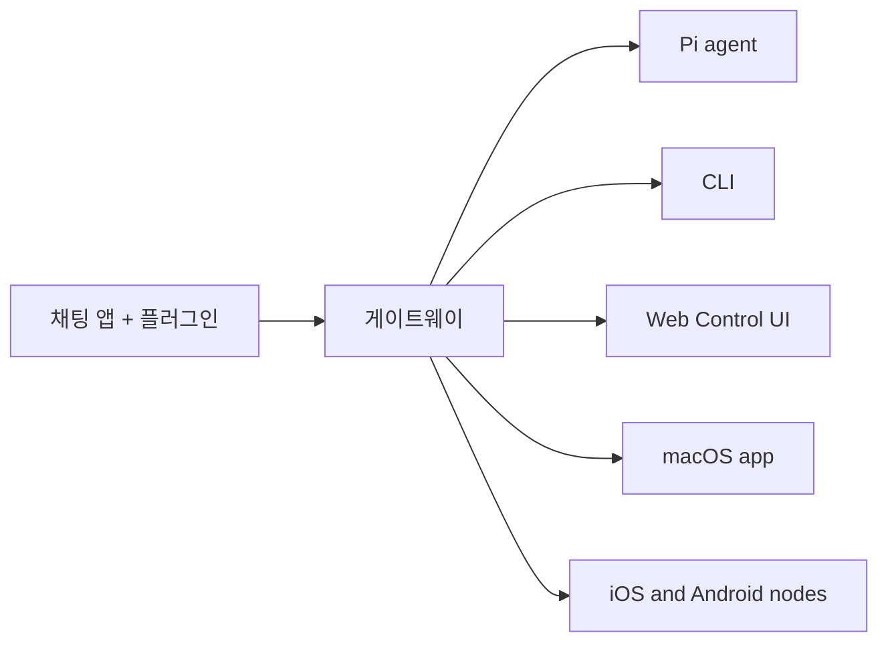

# OpenClaw 🦞

<BookBanner />


<p align="center">
    
    
</p>

> _"EXFOLIATE! EXFOLIATE!"_ — 우주 바닷가재, 아마도

<p align="center">
  <strong>Discord, Google Chat, iMessage, Matrix, Microsoft Teams, Signal, Slack, Telegram, WhatsApp, Zalo 등을 지원하는 AI 에이전트용 모든 OS 게이트웨이.</strong><br />
  메시지를 보내면 에이전트가 응답합니다. 내장 채널, 번들 채널 플러그인, WebChat, 모바일 노드를 하나의 게이트웨이로 운영하십시오.
</p>

> **시작하기** [→](/start/getting-started)
> OpenClaw를 설치하고 몇 분 안에 게이트웨이를 실행하십시오.


  > **온보딩 실행** [→](/start/wizard)
> `openclaw onboard` 및 페어링 플로우를 이용한 안내 설정.


  > **제어 UI 열기** [→](/web/control-ui)
> 채팅, 구성, 세션을 위한 브라우저 대시보드를 실행하십시오.


## OpenClaw란 무엇입니까?

OpenClaw는 즐겨 사용하는 채팅 앱과 채널 서피스 — 내장 채널 및 Discord, Google Chat, iMessage, Matrix, Microsoft Teams, Signal, Slack, Telegram, WhatsApp, Zalo 등과 같은 번들 또는 외부 채널 플러그인 — 를 Pi 같은 AI 코딩 에이전트에 연결하는 **자체 호스팅 게이트웨이**입니다. 자신의 머신(또는 서버)에서 단일 게이트웨이 프로세스를 실행하면, 이것이 메시징 앱과 항상 사용 가능한 AI 어시스턴트 사이의 브리지 역할을 합니다.

**누구를 위한 것입니까?** 데이터 통제권을 잃거나 호스팅 서비스에 의존하지 않고도 어디서든 메시지를 보낼 수 있는 개인 AI 어시스턴트를 원하는 개발자 및 파워 유저.

**무엇이 다릅니까?**

- **자체 호스팅**: 자신의 하드웨어에서 실행, 자신의 규칙
- **멀티채널**: 하나의 게이트웨이가 내장 채널과 번들 또는 외부 채널 플러그인을 동시에 제공
- **에이전트 네이티브**: 도구 사용, 세션, 메모리, 멀티에이전트 라우팅을 갖춘 코딩 에이전트를 위해 구축
- **오픈 소스**: MIT 라이선스, 커뮤니티 주도

**무엇이 필요합니까?** Node 24(권장) 또는 호환성을 위한 Node 22 LTS(`22.14+`), 선택한 프로바이더의 API 키, 그리고 5분. 최상의 품질과 보안을 위해 사용 가능한 최신 세대 모델 중 가장 강력한 것을 사용하십시오.

## 작동 방식



게이트웨이는 세션, 라우팅, 채널 연결의 단일 진실 소스입니다.

## 주요 기능

> **멀티채널 게이트웨이**
> Discord, iMessage, Signal, Slack, Telegram, WhatsApp, WebChat 등을 단일 게이트웨이 프로세스로.


  > **플러그인 채널**
> 번들 플러그인으로 일반 현재 릴리스에서 Matrix, Nostr, Twitch, Zalo 등을 추가합니다.


  > **멀티에이전트 라우팅**
> 에이전트, 워크스페이스, 발신자별 격리 세션.


  > **미디어 지원**
> 이미지, 오디오, 문서 송수신.


  > **Web Control UI**
> 채팅, 구성, 세션, 노드를 위한 브라우저 대시보드.


  > **모바일 노드**
> Canvas, 카메라, 음성 지원 워크플로를 위한 iOS 및 Android 노드 페어링.


## 빠른 시작

1. **OpenClaw 설치**

   ```bash
       npm install -g openclaw@latest
       ```

  2. **온보딩 및 서비스 설치**

   ```bash
       openclaw onboard --install-daemon
       ```

  3. **채팅**

   브라우저에서 Control UI를 열고 메시지를 보내십시오:
   
       ```bash
       openclaw dashboard
       ```
   
       또는 채널을 연결하고([Telegram](/channels/telegram)이 가장 빠릅니다) 휴대폰에서 채팅하십시오.


전체 설치 및 개발 설정이 필요하십니까? [시작하기](/start/getting-started)를 참조하십시오.

## 대시보드

게이트웨이 시작 후 브라우저 Control UI를 여십시오.

- 로컬 기본값: [http://127.0.0.1:18789/](http://127.0.0.1:18789/)
- 원격 접근: [웹 서피스](/web) 및 [Tailscale](/gateway/tailscale)

<p align="center">
  
</p>

## 구성 (선택 사항)

구성 파일은 `~/.openclaw/openclaw.json`에 있습니다.

- **아무것도 하지 않으면**, OpenClaw는 번들된 Pi 바이너리를 RPC 모드로 사용하며 발신자별 세션을 제공합니다.
- 잠금 설정을 원하신다면 `channels.whatsapp.allowFrom`과 (그룹의 경우) 멘션 규칙부터 시작하십시오.

예시:

```json5
{
  channels: {
    whatsapp: {
      allowFrom: ["+15555550123"],
      groups: { "*": { requireMention: true } },
    },
  },
  messages: { groupChat: { mentionPatterns: ["@openclaw"] } },
}
```

## 여기서 시작하십시오

> **문서 허브** [→](/start/hubs)
> 사용 사례별로 정리된 모든 문서 및 가이드.


  > **구성** [→](/gateway/configuration)
> 핵심 게이트웨이 설정, 토큰, 프로바이더 구성.


  > **원격 접근** [→](/gateway/remote)
> SSH 및 테일넷 접근 패턴.


  > **채널** [→](/channels/telegram)
> Feishu, Microsoft Teams, WhatsApp, Telegram, Discord 등의 채널별 설정.


  > **노드** [→](/nodes)
> 페어링, Canvas, 카메라, 기기 동작이 포함된 iOS 및 Android 노드.


  > **도움말** [→](/help)
> 일반적인 수정 사항 및 문제 해결 진입점.


## 더 알아보기

> **전체 기능 목록** [→](/concepts/features)
> 완전한 채널, 라우팅, 미디어 기능.


  > **멀티에이전트 라우팅** [→](/concepts/multi-agent)
> 워크스페이스 격리 및 에이전트별 세션.


  > **보안** [→](/gateway/security)
> 토큰, 허용 목록, 안전 제어.


  > **문제 해결** [→](/gateway/troubleshooting)
> 게이트웨이 진단 및 일반적인 오류.


  > **소개 및 크레딧** [→](/reference/credits)
> 프로젝트 기원, 기여자, 라이선스.


