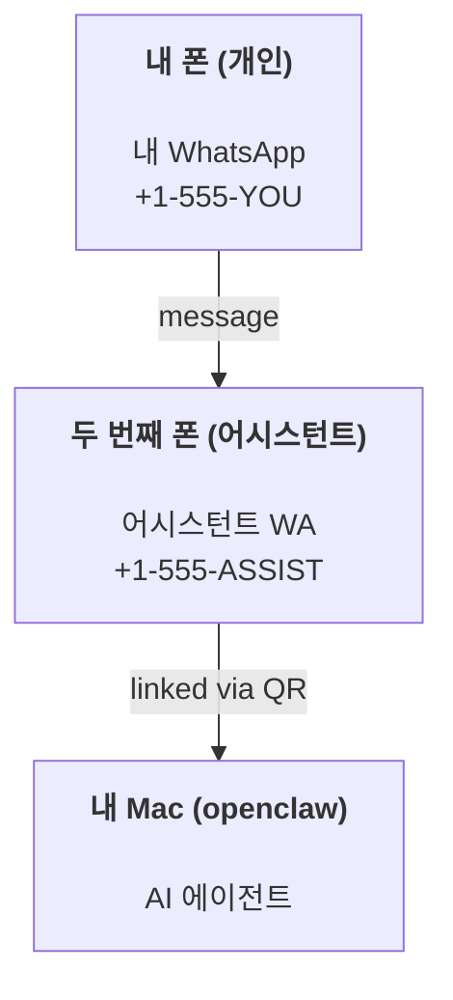

# OpenClaw로 개인 어시스턴트 구축하기

OpenClaw는 Discord, Google Chat, iMessage, Matrix, Microsoft Teams, Signal, Slack, Telegram, WhatsApp, Zalo 등을 AI 에이전트에 연결하는 셀프 호스팅 게이트웨이입니다. 이 가이드는 항상 켜져 있는 AI 어시스턴트처럼 동작하는 전용 WhatsApp 번호인 "개인 어시스턴트" 설정을 다룹니다.

## ⚠️ 보안 우선

에이전트를 다음과 같은 위치에 배치하는 것입니다:

- 머신에서 명령 실행 (도구 정책에 따라)
- 워크스페이스에서 파일 읽기/쓰기
- WhatsApp/Telegram/Discord/Mattermost 및 기타 번들 채널을 통해 메시지 다시 보내기

보수적으로 시작하십시오:

- 항상 `channels.whatsapp.allowFrom`을 설정하십시오 (개인 Mac에서 전 세계에 공개된 상태로 실행하지 마십시오).
- 어시스턴트에 전용 WhatsApp 번호를 사용하십시오.
- 하트비트는 이제 기본적으로 30분마다 실행됩니다. 설정을 신뢰할 때까지 `agents.defaults.heartbeat.every: "0m"`을 설정하여 비활성화하십시오.

## 사전 조건

- OpenClaw 설치 및 온보딩 완료 — 아직 완료하지 않은 경우 [시작하기](/start/getting-started) 참조
- 어시스턴트용 두 번째 전화번호 (SIM/eSIM/선불)

## 투 폰 설정 (권장)

다음과 같이 설정하십시오:



개인 WhatsApp을 OpenClaw에 연결하면 모든 메시지가 "에이전트 입력"이 됩니다. 이것은 거의 원하는 바가 아닙니다.

## 5분 빠른 시작

1. WhatsApp Web 페어링 (QR 표시; 어시스턴트 폰으로 스캔):

```bash
openclaw channels login
```

2. Gateway 시작 (계속 실행):

```bash
openclaw gateway --port 18789
```

3. `~/.openclaw/openclaw.json`에 최소 구성 입력:

```json5
{
  gateway: { mode: "local" },
  channels: { whatsapp: { allowFrom: ["+15555550123"] } },
}
```

허용 목록에 있는 폰에서 어시스턴트 번호로 메시지를 보내십시오.

온보딩이 완료되면, 대시보드가 자동으로 열리고 깔끔한 (토큰화되지 않은) 링크가 출력됩니다. 인증을 요청하는 경우, 구성된 공유 비밀을 Control UI 설정에 붙여넣으십시오. 온보딩은 기본적으로 토큰을 사용하지만 (`gateway.auth.token`), `gateway.auth.mode`를 `password`로 전환한 경우 비밀번호 인증도 작동합니다. 나중에 다시 열려면: `openclaw dashboard`.

## 에이전트에게 워크스페이스 제공 (AGENTS)

OpenClaw는 워크스페이스 디렉토리에서 운영 지침과 "메모리"를 읽습니다.

기본적으로 OpenClaw는 `~/.openclaw/workspace`를 에이전트 워크스페이스로 사용하며, 설정/첫 에이전트 실행 시 (`AGENTS.md`, `SOUL.md`, `TOOLS.md`, `IDENTITY.md`, `USER.md`, `HEARTBEAT.md` 스타터 파일 포함) 자동으로 생성합니다. `BOOTSTRAP.md`는 워크스페이스가 새로 생성될 때만 만들어집니다 (삭제 후 다시 나타나서는 안 됩니다). `MEMORY.md`는 선택 사항입니다 (자동 생성되지 않음); 존재할 경우 일반 세션에 로드됩니다. 서브에이전트 세션은 `AGENTS.md`와 `TOOLS.md`만 주입합니다.

팁: 이 폴더를 OpenClaw의 "메모리"처럼 취급하고 git 저장소로 만드십시오 (가급적 비공개로) 그러면 `AGENTS.md` + 메모리 파일이 백업됩니다. git이 설치된 경우 새 워크스페이스는 자동으로 초기화됩니다.

```bash
openclaw setup
```

전체 워크스페이스 레이아웃 + 백업 가이드: [에이전트 워크스페이스](/concepts/agent-workspace)
메모리 워크플로우: [메모리](/concepts/memory)

선택 사항: `agents.defaults.workspace`로 다른 워크스페이스 선택 (`~` 지원).

```json5
{
  agent: {
    workspace: "~/.openclaw/workspace",
  },
}
```

이미 저장소에서 자체 워크스페이스 파일을 제공하는 경우, 부트스트랩 파일 생성을 완전히 비활성화할 수 있습니다:

```json5
{
  agent: {
    skipBootstrap: true,
  },
}
```

## "어시스턴트"로 만드는 구성

OpenClaw는 기본적으로 좋은 어시스턴트 설정이지만, 일반적으로 다음을 조정하고 싶을 것입니다:

- [`SOUL.md`](/concepts/soul)의 페르소나/지침
- 사고 기본값 (원하는 경우)
- 하트비트 (신뢰할 때)

예시:

```json5
{
  logging: { level: "info" },
  agent: {
    model: "anthropic/claude-opus-4-6",
    workspace: "~/.openclaw/workspace",
    thinkingDefault: "high",
    timeoutSeconds: 1800,
    // 0으로 시작; 나중에 활성화.
    heartbeat: { every: "0m" },
  },
  channels: {
    whatsapp: {
      allowFrom: ["+15555550123"],
      groups: {
        "*": { requireMention: true },
      },
    },
  },
  routing: {
    groupChat: {
      mentionPatterns: ["@openclaw", "openclaw"],
    },
  },
  session: {
    scope: "per-sender",
    resetTriggers: ["/new", "/reset"],
    reset: {
      mode: "daily",
      atHour: 4,
      idleMinutes: 10080,
    },
  },
}
```

## 세션 및 메모리

- 세션 파일: `~/.openclaw/agents/&lt;agentId&gt;/sessions/{{SessionId}}.jsonl`
- 세션 메타데이터 (토큰 사용량, 마지막 라우트 등): `~/.openclaw/agents/&lt;agentId&gt;/sessions/sessions.json` (레거시: `~/.openclaw/sessions/sessions.json`)
- `/new` 또는 `/reset`은 해당 채팅의 새 세션을 시작합니다 (`resetTriggers`를 통해 구성 가능). 단독으로 전송되면 에이전트가 짧은 인사말로 재설정을 확인합니다.
- `/compact [instructions]`는 세션 컨텍스트를 컴팩트하고 남은 컨텍스트 예산을 보고합니다.

## 하트비트 (프로액티브 모드)

기본적으로 OpenClaw는 다음 프롬프트로 30분마다 하트비트를 실행합니다:
`Read HEARTBEAT.md if it exists (workspace context). Follow it strictly. Do not infer or repeat old tasks from prior chats. If nothing needs attention, reply HEARTBEAT_OK.`
비활성화하려면 `agents.defaults.heartbeat.every: "0m"`을 설정하십시오.

- `HEARTBEAT.md`가 존재하지만 실질적으로 비어있는 경우 (빈 줄과 `# 제목` 같은 마크다운 헤더만), OpenClaw는 API 호출을 절약하기 위해 하트비트 실행을 건너뜁니다.
- 파일이 없는 경우 하트비트는 계속 실행되고 모델이 처리 방법을 결정합니다.
- 에이전트가 `HEARTBEAT_OK`로 응답하면 (짧은 패딩 선택 사항; `agents.defaults.heartbeat.ackMaxChars` 참조), OpenClaw는 해당 하트비트의 아웃바운드 전달을 억제합니다.
- 기본적으로 DM 스타일 `user:&lt;id&gt;` 대상으로의 하트비트 전달은 허용됩니다. 하트비트 실행을 활성 상태로 유지하면서 직접 대상 전달을 억제하려면 `agents.defaults.heartbeat.directPolicy: "block"`을 설정하십시오.
- 하트비트는 전체 에이전트 턴을 실행합니다 — 짧은 간격은 더 많은 토큰을 소모합니다.

```json5
{
  agent: {
    heartbeat: { every: "30m" },
  },
}
```

## 미디어 입출력

인바운드 첨부 파일 (이미지/오디오/문서)은 템플릿을 통해 명령에 노출될 수 있습니다:

- `{{MediaPath}}` (로컬 임시 파일 경로)
- `{{MediaUrl}}` (의사 URL)
- `{{Transcript}}` (오디오 전사가 활성화된 경우)

에이전트의 아웃바운드 첨부 파일: 자체 줄에 `MEDIA:&lt;path-or-url&gt;`을 포함 (공백 없음). 예시:

```
스크린샷입니다.
MEDIA:https://example.com/screenshot.png
```

OpenClaw는 이를 추출하여 텍스트와 함께 미디어로 전송합니다.

로컬 경로 동작은 에이전트와 동일한 파일 읽기 신뢰 모델을 따릅니다:

- `tools.fs.workspaceOnly`가 `true`인 경우, 아웃바운드 `MEDIA:` 로컬 경로는 OpenClaw 임시 루트, 미디어 캐시, 에이전트 워크스페이스 경로 및 샌드박스 생성 파일로 제한됩니다.
- `tools.fs.workspaceOnly`가 `false`인 경우, 아웃바운드 `MEDIA:`는 에이전트가 이미 읽을 수 있는 호스트 로컬 파일을 사용할 수 있습니다.
- 호스트 로컬 전송은 여전히 미디어 및 안전한 문서 형식 (이미지, 오디오, 비디오, PDF 및 Office 문서)만 허용합니다. 일반 텍스트 및 비밀과 유사한 파일은 전송 가능한 미디어로 처리되지 않습니다.

즉, 워크스페이스 외부에서 생성된 이미지/파일은 fs 정책이 이미 해당 읽기를 허용하는 경우 전송할 수 있으며, 임의의 호스트 텍스트 첨부 파일 유출을 다시 열지 않습니다.

## 운영 체크리스트

```bash
openclaw status          # 로컬 상태 (자격 증명, 세션, 대기 이벤트)
openclaw status --all    # 전체 진단 (읽기 전용, 붙여넣기 가능)
openclaw status --deep   # 채널 프로브가 지원될 때 라이브 헬스 프로브로 게이트웨이에 요청
openclaw health --json   # 게이트웨이 헬스 스냅샷 (WS; 기본값은 새로운 캐시된 스냅샷 반환 가능)
```

로그는 `/tmp/openclaw/` 아래에 있습니다 (기본값: `openclaw-YYYY-MM-DD.log`).

## 다음 단계

- WebChat: [WebChat](/web/webchat)
- 게이트웨이 운영: [게이트웨이 런북](/gateway)
- 크론 + 웨이크업: [크론 작업](/automation/cron-jobs)
- macOS 메뉴 바 컴패니언: [OpenClaw macOS 앱](/platforms/macos)
- iOS 노드 앱: [iOS 앱](/platforms/ios)
- Android 노드 앱: [Android 앱](/platforms/android)
- Windows 상태: [Windows (WSL2)](/platforms/windows)
- Linux 상태: [Linux 앱](/platforms/linux)
- 보안: [보안](/gateway/security)
